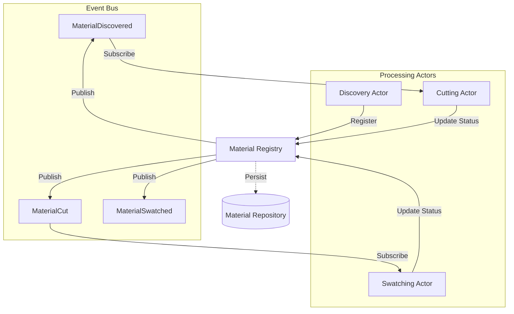
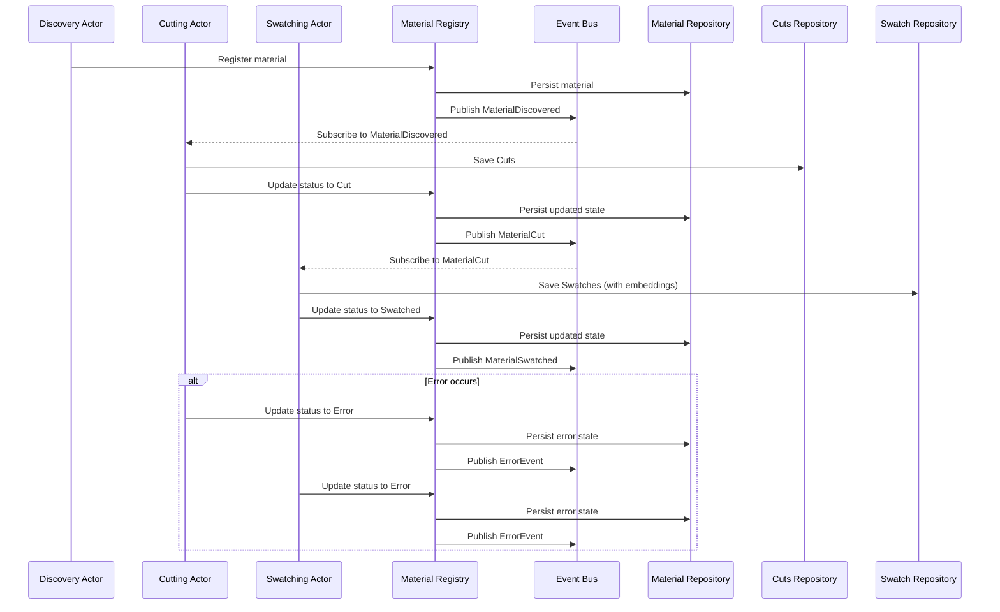
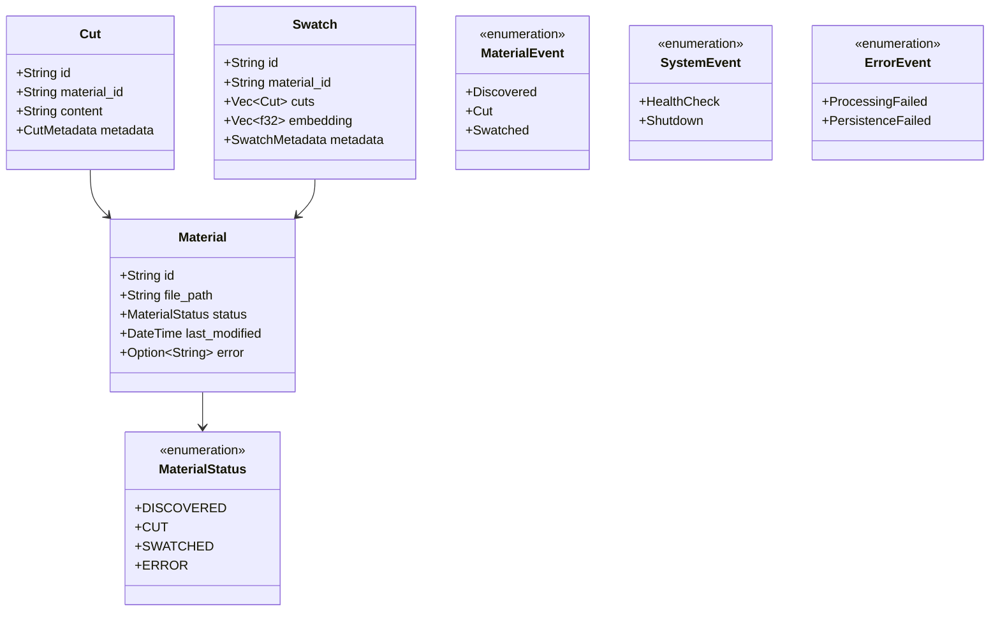

# Architecture Overview

## Project Definition

Quilt is a local-first, modular memory and context engine designed to watch a user's work, fragment documents into meaningful pieces (swatches), embed them into a searchable memory (the swatch book), and assemble contextual spreads in response to queries.

## Core Requirements

1. **Local-first Architecture** - All operations must run on the user's machine without cloud dependencies
2. **Modular Component System** - Independent, swappable components for watching, swatching, embedding, and querying
3. **Privacy-preserving** - No data leakage or external dependencies required
4. **Actor-based Processing Pipeline** - Implement using Rust/Tokio with direct messaging between actors
5. **Material Processing Workflow**:
   - Discovery of new documents/files
   - Cutting into meaningful fragments (swatches)
   - Labeling/embedding of swatches
   - Storage in a queryable repository
   - Assembly of contextual spreads for queries

## System Architecture Overview

Quilt uses an **event-driven actor model architecture** implemented with Actix for actor lifecycle management and Tokio for concurrency primitives. The system processes materials through a pipeline of independent actors that communicate via an Event Bus, with a Material Registry serving as the central coordinator for state and event publishing.

> For detailed implementation specifics of the actor model, see [Actor Model Architecture](actor-model-architecture.md).

## Key Technical Components

1. **Material Registry** - Central coordinator holding material state and publishing events.
2. **Repository Traits (`MaterialRepository`, `CutsRepository`, `SwatchRepository`)** - Define interfaces for data persistence (material status, cut content, swatch data & embeddings).
3. **Concrete Repositories (`SqliteMaterialRepository`, `SqliteCutsRepository`, `SqliteSwatchRepository`)** - Current implementations of the repository traits using SQLite for persistence. Swatches and their embeddings are stored here.
4. **Discovery Actor** - Monitors input sources for new/updated materials.
5. **Cutting Actor** - Processes materials by cutting them into swatches (structured text fragments).
6. **Swatching Actor** - Generates vector embeddings for swatches using a local model and triggers persistence via `SwatchRepository`.
7. **Event Bus** - Facilitates communication between actors via published events.

## Material Processing Flow

## Domain Model

