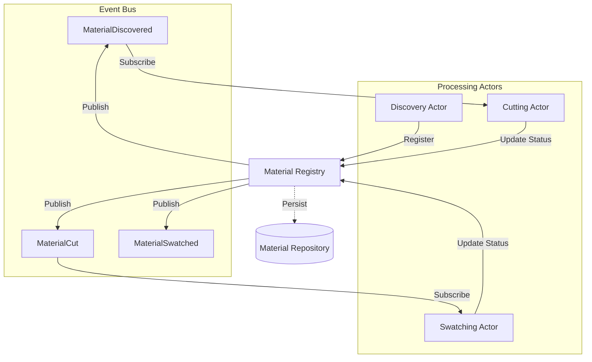
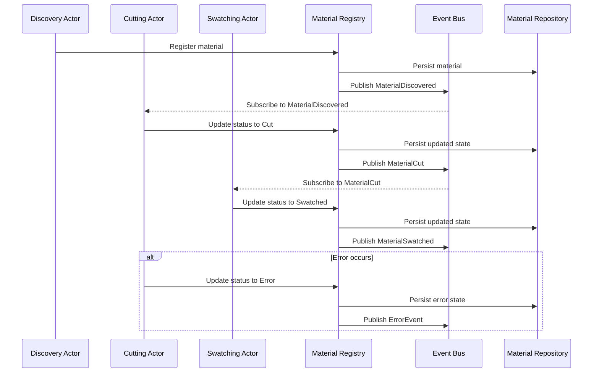
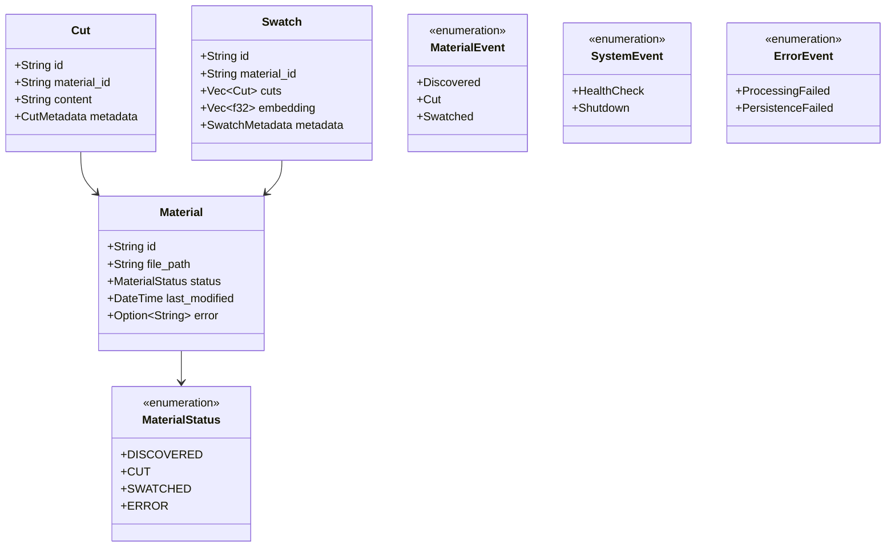

# Architecture Overview

## Project Definition

Quilt is a local-first, modular memory and context engine designed to watch a user's work, fragment documents into meaningful pieces (swatches), embed them into a searchable memory (the swatch book), and assemble contextual spreads in response to queries.

## Core Requirements

1. **Local-first Architecture** - All operations must run on the user's machine without cloud dependencies
2. **Modular Component System** - Independent, swappable components for watching, swatching, embedding, and querying
3. **Privacy-preserving** - No data leakage or external dependencies required
4. **Actor-based Processing Pipeline** - Implement using Rust/Tokio with direct messaging between actors
5. **Material Processing Workflow**:
   - Discovery of new documents/files
   - Cutting into meaningful fragments (swatches)
   - Labeling/embedding of swatches
   - Storage in a queryable repository
   - Assembly of contextual spreads for queries

## System Architecture Overview

Quilt uses an **event-driven actor model architecture** implemented with Actix for actor lifecycle management and Tokio for concurrency primitives. The system processes materials through a pipeline of independent actors that communicate via an Event Bus, with a Material Registry serving as the central coordinator for state and event publishing.

> For detailed implementation specifics of the actor model, see [Actor Model Architecture](actor-model-architecture.md).

## Key Technical Components

1. **Material Repository** - Thread-safe data store for materials and their processing state
2. **Discovery Worker** - Monitors input sources for new/updated materials
3. **Cutting Worker** - Processes materials by cutting them into swatches
4. **Labeling Worker** - Executes embedding operations on swatches
5. **Vector-based Storage** - Persists embedded swatches for semantic retrieval

## Material Processing Flow

## Domain Model

