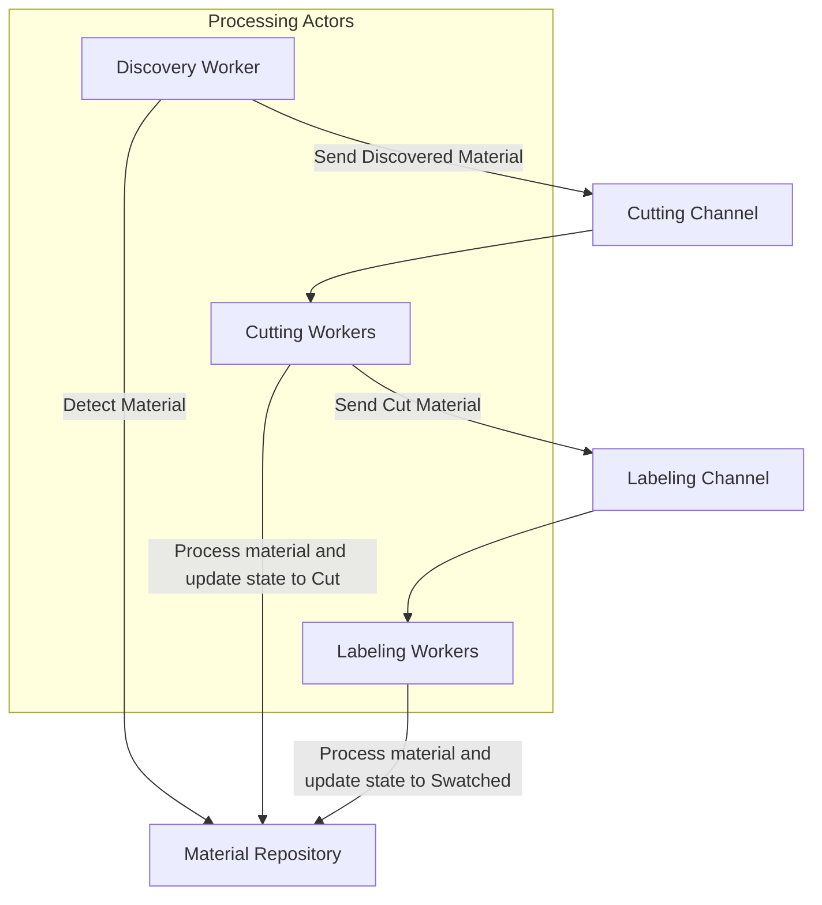

# Quilt Architecture – Simplified Actor Model with a Dedicated Repository

This document describes the architecture for Quilt—a local-first, modular memory and context engine. Quilt watches your work, fragments your documents into meaningful swatches, embeds them into a searchable swatch book, and assembles contextual spreads in response to queries.

---

## High-Level Workflow

Each material goes through a fairly linear pipeline:

1. **Discovery Stage:**  
   A Discovery Worker scans for new or updated materials. When a material is found, it is stored in the Material Repository (a simple, thread-safe data store) and a `Discovered` message is sent directly to the Cutting Stage.

2. **Cutting Stage:**  
   The Cutting Worker(s) receive the `Discovered` message from a dedicated Cutting Channel, retrieve the corresponding material from the Repository as needed, perform cutting operations, update the material’s state in the Repository to _Cut_, and then send a `Cut` message to the Labeling Stage.

3. **Labeling Stage:**  
   The Labeling Worker(s) (the bottleneck, due to heavyweight processing such as LLM embedding) receive the `Cut` message from a Labeling Channel, process the material further (i.e., labeling/embedding), update its state in the Repository to _Swatched_, and optionally trigger downstream actions (e.g., caching query results).

In this model, each worker is implemented as an independent actor (a Tokio task that loops over its mailbox), and messages are sent directly from one stage to the next via channel operators.

---

## Architecture Diagram

Below is an updated diagram where processing actors (workers) directly communicate via channels, and the Material Repository is shown separately as a shared data store:



---

## Component Breakdown

### Discovery Worker (Actor)

- **Role:**  
  Continuously monitors input sources (e.g., folders) for new or updated materials.
- **Behavior:**  
  When a new material is detected, it stores the material in the Material Repository and immediately sends a `MaterialMessage::Discovered` on the Cutting Channel.
- **Implementation:**  
  Implemented as an asynchronous Tokio task that listens for file system changes (or similar events).

### Cutting Worker(s) (Actor)

- **Role:**  
  Receives `Discovered` messages and retrieves the corresponding material from the Repository if needed.
- **Behavior:**  
  Processes the material by cutting it into swatches, updates the Repository to set the state to _Cut_, and sends a `MaterialMessage::Cut` to the Labeling stage.
- **Implementation:**  
  Runs either as a single task or as part of a worker pool, reading from a bounded Tokio mpsc channel.

### Labeling Worker(s) (Actor)

- **Role:**  
  Receives `Cut` messages and executes the heavy labeling/embedding operations.
- **Behavior:**  
  Processes the material, updates its state in the Repository to _Swatched_, and optionally returns output for querying or further actions.
- **Implementation:**  
  Typically the bottleneck; can be scaled horizontally with a pool of actors. Coordination is ensured by design in that each material is updated once in the Repository.

### Material Repository (Data Store)

- **Role:**  
  Acts solely as a thread-safe data store.
- **Responsibilities:**
  - Register new materials.
  - Update and query material states.
  - Enforce idempotence (only one state transition per material).
- **Implementation:**  
  A simple module that uses structures like `Arc<RwLock<HashMap<...>>>` to allow concurrent read and write operations. It does not handle messages or run its own actor loop.

---

## Message Types

Actors communicate using strongly typed messages defined by the `MaterialMessage` enum:

```rust
pub enum MaterialMessage {
    /// Indicates that a new material has been discovered.
    Discovered(Material),
    /// Indicates that the material has been cut into swatches.
    Cut(Material),
    /// Indicates that the material has been labeled/embedded (swatched).
    Swatched(Material),
    /// Indicates an error during processing.
    Error(Material, String),
    /// Shutdown signal.
    Shutdown,
}
```

Each message is sent through a Tokio mpsc channel that connects one stage directly to the next. The Repository is updated directly by the corresponding actors without message mediation.

---

## Optimizing for Concurrency and Preventing Duplicate Work

- **Direct Messaging:**  
  Since messages are sent directly between actors (Discovery → Cutting → Labeling), there’s no need for an intermediary dispatcher. This reduces overhead and simplifies the flow.
- **Repository as a Single Source of Truth:**  
  The Repository enforces idempotent state transitions. Even if duplicate messages are accidentally received, the Repository’s logic ensures that a material’s state is updated only once per stage.
- **Worker Pool Coordination:**  
  For stages that need parallel processing (e.g., Labeling), a pool of worker actors can pull from the same channel. Synchronization can be achieved with atomic operations or task-claiming mechanisms to prevent duplicate processing of the same material.

- **Backpressure:**  
  Bounded channels ensure that if a stage lags (for example, if Labeling workers are overwhelmed), the upstream actors are slowed accordingly, preventing resource exhaustion.

---

## Final Thoughts

This architecture uses idiomatic Tokio patterns to create an actor-based system where:

- **Actors (workers)** are responsible for each stage of processing.
- **The Material Repository** acts as a shared, centralized state store and is not an actor.
- **Messages** flow directly between stages via Tokio channels, eliminating the need for an explicit Dispatcher actor.

This model offers modularity, clear separation of concerns, and room for scalability if the load increases, while keeping the design straightforward for a modest system. Future improvements can include enhanced caching, dynamic scaling of worker pools, and integration with external databases for persistent state.
