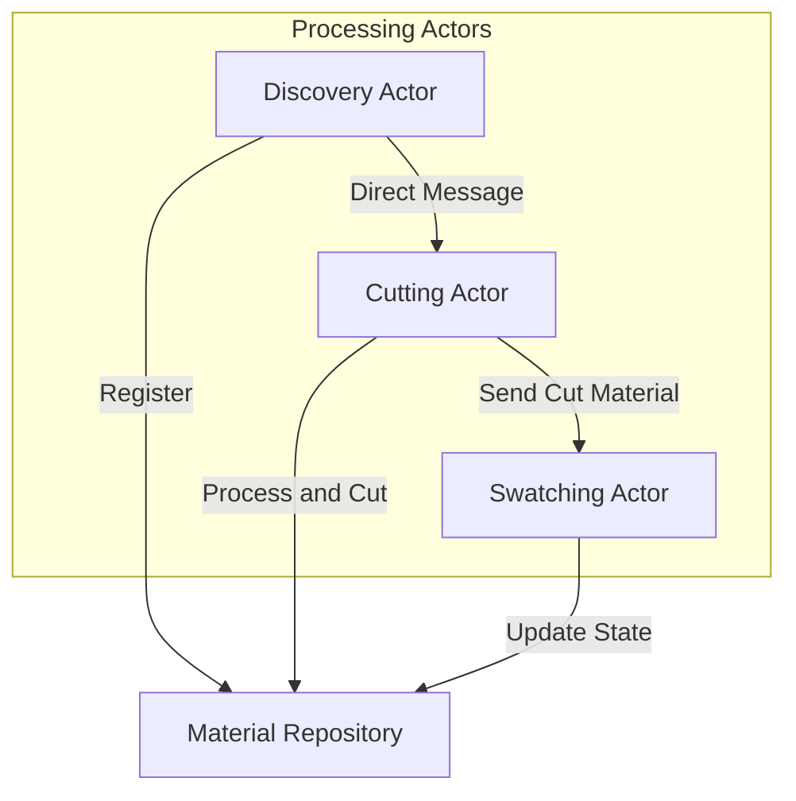

# Quilt Architecture – Simplified Actor Model with a Dedicated Repository

This document describes the architecture for Quilt—a local-first, modular memory and context engine. Quilt watches your work, fragments your documents into meaningful swatches, embeds them into a searchable swatch book, and assembles contextual spreads in response to queries.

---

## High-Level Workflow

Each material goes through a fairly linear pipeline:

1. **Discovery Stage:**  
   A Discovery Actor scans for new or updated materials. When a material is found, it is stored in the Material Repository and a `MaterialDiscovered` message is sent directly to the Cutting Actor.

2. **Cutting Stage:**  
   The Cutting Actor receives the `MaterialDiscovered` message, retrieves the corresponding material from the Repository if needed, performs cutting operations, updates the material's state in the Repository to _Cut_, and then sends a `CutMaterial` message directly to the Swatching Actor.

3. **Swatching Stage:**  
   The Swatching Actor receives the `CutMaterial` message, processes the material (performing heavyweight operations like LLM embedding), updates its state in the Repository to _Swatched_, and optionally triggers downstream actions (e.g., caching query results).

In this model, each worker is implemented as an independent actor (a Tokio task that loops over its mailbox), and messages are sent directly from one stage to the next via channel operators.

---

## Architecture Diagram

Below is the diagram showing our initial simplified architecture:



---

## Design Decisions

### Message Flow Strategy

We use direct messaging between actors in our initial implementation:

1. **Direct Messaging** (Discovery → Cutting → Swatching):
   - Simple point-to-point communication
   - Lower latency and straightforward implementation
   - Clear message flow and error handling
   - Sufficient for initial implementation and testing

This approach follows the principle of "make it work, make it right, make it fast" - starting with a simple, reliable implementation that can be enhanced later.

---

## Component Breakdown

### Discovery Actor

- **Role:**  
  Continuously monitors input sources (e.g., folders) for new or updated materials.
- **Behavior:**  
  When a new material is detected, it stores the material in the Material Repository and immediately sends a `MaterialDiscovered` message to the Cutting Actor.
- **Implementation:**  
  Implemented as an asynchronous Tokio task that listens for file system changes (or similar events).

### Cutting Actor

- **Role:**  
  Receives `MaterialDiscovered` messages and processes materials into cuts.
- **Behavior:**  
  Processes the material by cutting it into swatches, updates the Repository to set the state to _Cut_, and sends a `CutMaterial` message to the Swatching Actor.
- **Implementation:**  
  Single worker implementation that handles the intermediate processing stage between discovery and swatching.

### Swatching Actor

- **Role:**  
  Receives `CutMaterial` messages and executes the heavy embedding operations to create swatches.
- **Behavior:**  
  Processes the material, updates its state in the Repository to _Swatched_, and optionally returns output for querying or further actions.
- **Implementation:**  
  Single worker implementation that handles the final processing stage, including embedding generation and swatch creation.

### Material Repository (Data Store)

- **Role:**  
  Acts solely as a thread-safe data store.
- **Responsibilities:**
  - Register new materials.
  - Update and query material states.
  - Enforce idempotence (only one state transition per material).
- **Implementation:**  
  A simple module that uses structures like `Arc<RwLock<HashMap<...>>>` to allow concurrent read and write operations. It does not handle messages or run its own actor loop.

---

## Message Types

The system uses actor-specific message types for clear communication boundaries:

```rust
/// Messages for material discovery
pub struct MaterialDiscovered {
    pub material: Material,  // Full material needed for initial registration
}

/// Messages for cut materials
pub struct CutMaterial {
    pub material_id: String,  // Reference to original material
    pub cut_ids: Vec<String>, // IDs of the generated cuts
}

/// Messages for swatched (cut + labeled) materials
pub struct MaterialSwatched {
    pub material_id: String,  // Reference to original material
    pub cut_id: String,      // Reference to the cut that was processed
    pub swatch_id: String,   // ID of the generated swatch
}

/// Common message types
pub enum SystemMessage {
    /// Signal to check actor health
    Ping,
    /// Signal to gracefully shutdown
    Shutdown,
}

/// Error messages that can occur during processing
pub struct ProcessingError {
    pub material_id: String,
    pub stage: ProcessingStage,
    pub error: String,
}

pub enum ProcessingStage {
    Discovery,
    Cutting,
    Swatching,  // Changed from Labeling to be consistent
}
```

Messages are passed between actors using direct point-to-point communication:

1. Direct actor-to-actor messaging for all flows:
   - `MaterialDiscovered` includes full material for initial registration
   - All subsequent messages use IDs to reference materials, cuts, and swatches
   - Workers fetch required data from repository as needed

---

## Optimizing for Concurrency and Preventing Duplicate Work

- **Direct Messaging:**  
  Messages are sent directly between actors without intermediaries, providing a simple and reliable communication pattern for our initial implementation.
- **Repository as a Single Source of Truth:**  
  The Repository enforces idempotent state transitions. Even if duplicate messages are accidentally received, the Repository's logic ensures that a material's state is updated only once per stage.
- **Backpressure:**  
  Bounded channels ensure that if any stage lags, the upstream actors are slowed accordingly, preventing resource exhaustion.

---

## Future Scaling Proposals

As the system grows, we can enhance its scalability through several proposed improvements:

### 1. Swatching Router for Dynamic Scaling

The most significant bottleneck in our system is likely to be the swatching stage, which performs computationally intensive embedding operations. To address this, we propose adding a Swatching Router that would:

- Manage a pool of Swatching Actors
- Distribute work using round-robin or more sophisticated strategies
- Monitor queue lengths and worker health
- Dynamically scale the worker pool based on load

This enhancement would require:

- Adding a router actor between Cutting and Swatching stages
- Implementing worker pool management
- Adding health monitoring and scaling logic
- Enhancing the message routing system

### 2. Additional Scaling Improvements

- Enhanced caching strategies for frequently accessed materials and embeddings
- Persistent storage integration for better resource management
- Parallel processing capabilities in the Cutting stage if needed
- Improved monitoring and metrics collection
- Load shedding and rate limiting capabilities

These improvements can be implemented incrementally as needed, based on real-world usage patterns and performance requirements.

---

## Final Thoughts

This architecture uses idiomatic Tokio patterns to create a straightforward actor-based system where:

- **Actors** are responsible for each stage of processing
- **The Material Repository** acts as a shared, centralized state store
- **Messages** flow directly between stages via Tokio channels

The initial implementation prioritizes simplicity and reliability, while the design allows for future scalability improvements as needed. This approach lets us validate the core functionality and gather real-world usage data before adding complexity for scaling.
