# Quilt Architecture – Event-Driven Actor Model with a Material Registry

This document describes the architecture for Quilt—a local-first, modular memory and context engine. Quilt watches your work, fragments your documents into meaningful swatches, embeds them into a searchable swatch book, and assembles contextual spreads in response to queries.

---

## High-Level Workflow

Materials flow through a pipeline of independent processing stages:

1. **Discovery Stage:**  
   A Discovery Actor scans for new or updated materials. When a material is found, it registers it with the Material Registry, which:

   - Stores the material in memory
   - Persists it to the Material Repository
   - Publishes a MaterialDiscovered event

2. **Cutting Stage:**  
   The Cutting Actor:

   - Subscribes to MaterialDiscovered events
   - Processes materials into cuts
   - Stores Cuts in the CutsRespository
   - Updates material status via the Registry (which persists and publishes MaterialCut event)

3. **Swatching Stage:**  
   The Swatching Actor:
   - Subscribes to MaterialCut events
   - Processes materials (performing embedding)
   - Stores Swatches in the SwatchRepository
   - Updates material status via the Registry (which persists and publishes MaterialSwatched event)

In this model, each worker is implemented as an independent actor (a Tokio task that processes events), communication happens through a system-wide event bus, and state is managed by the Material Registry with persistence handled by the Material Repository.

---

## Architecture Diagram

Below is the diagram showing our event-driven architecture:

```mermaid
graph TB
    subgraph EventBus["Event Bus"]
        E1[MaterialDiscovered]
        E2[MaterialCut]
        E3[MaterialSwatched]
    end

    subgraph ProcessingActors["Processing Actors"]
        DW[Discovery Actor]
        CW[Cutting Actor]
        SW[Swatching Actor]
    end

    Reg[Material Registry]
    DB[(Material Repository)]

    %% Discovery flow
    DW -->|"Register"| Reg
    Reg -->|"Publish"| E1
    E1 -->|"Subscribe"| CW

    %% Cutting flow
    CW -->|"Update Status"| Reg
    Reg -->|"Publish"| E2
    E2 -->|"Subscribe"| SW

    %% Swatching flow
    SW -->|"Update Status"| Reg
    Reg -->|"Publish"| E3

    %% Persistence flow
    Reg -.->|"Persist"| DB

    %% Style - using more subtle, dark-mode friendly colors
    classDef registry fill:#2d4f67,stroke:#88c0d0,stroke-width:2px;
    classDef eventBus fill:#3b4252,stroke:#88c0d0,stroke-width:2px;
    classDef repository fill:#4c566a,stroke:#88c0d0,stroke-width:2px;
    class Reg registry;
    class E1,E2,E3 eventBus;
    class DB repository;
```



---

## Design Decisions

### Message Flow Strategy

We use an event-driven approach with pub/sub messaging:

1. **Event-Based Communication:**

   - Registry publishes events on state changes
   - Actors subscribe to events they need to process
   - No direct actor-to-actor coupling
   - Easy to add new processors or observers

2. **State Management:**

   - Registry manages in-memory state
   - Repository handles persistence
   - State changes are atomic with event publishing
   - Clear separation of concerns

3. **Benefits:**
   - Loose coupling between components
   - Easy to add new processors
   - Simple testing (can verify events)
   - Clear system boundaries
   - Natural support for parallel processing

This approach provides a clean separation of concerns while maintaining data consistency and system extensibility.

---

## Component Breakdown

### Discovery Actor

- **Role:**  
  Continuously monitors input sources (e.g., folders) for new or updated materials.
- **Behavior:**  
  When a new material is detected, it registers it with the Registry, which handles persistence and event publishing.
- **Implementation:**  
  Implemented as an asynchronous Tokio task that listens for file system changes.

### Cutting Actor

- **Role:**  
  Processes materials into cuts based on MaterialDiscovered events.
- **Behavior:**
  - Subscribes to MaterialDiscovered events
  - Processes materials into cuts
  - Updates material status via the Registry
- **Implementation:**  
  Event-driven worker that processes materials as they are discovered.

### Swatching Actor

- **Role:**  
  Creates swatches from cut materials based on MaterialCut events.
- **Behavior:**
  - Subscribes to MaterialCut events
  - Performs embedding operations
  - Updates material status via the Registry
- **Implementation:**  
  Event-driven worker handling the final processing stage.

### Material Registry

- **Role:**  
  Acts as the central coordinator for material state and event publishing.
- **Responsibilities:**
  - Coordinate with Repository for persistence
  - Publish state change events
  - Enforce idempotence (only one state transition per material)
  - Maintain consistency between state, persistence, and events
- **Implementation:**  
  A module that combines thread-safe state management with event publishing and persistence coordination:

### Material Repository

- **Role:**  
  Handles persistence of materials and their state.
- **Responsibilities:**
  - Save and load materials
  - Handle persistence errors
  - Provide atomic storage operations
- **Implementation:**  
  A trait that can be implemented for different storage backends:
  ```rust
  #[async_trait]
  pub trait MaterialRepository: Send + Sync + 'static {
      async fn save(&self, material: &Material) -> Result<()>;
      async fn load(&self, id: &str) -> Result<Option<Material>>;
      async fn delete(&self, id: &str) -> Result<()>;
  }
  ```

---

## Event Types

The system uses domain events for communication:

```rust
/// Events for material lifecycle
pub enum MaterialEvent {
    /// Emitted when a new material is discovered and persisted
    Discovered {
        material_id: String,
        file_path: String,
    },
    /// Emitted when a material is cut and persisted
    Cut {
        material_id: String,
        cut_ids: Vec<String>,
    },
    /// Emitted when a material is swatched and persisted
    Swatched {
        material_id: String,
        swatch_id: String,
    },
}

/// System events
pub enum SystemEvent {
    /// Actor health check
    HealthCheck { actor_id: String },
    /// Graceful shutdown signal
    Shutdown,
}

/// Error events
pub enum ErrorEvent {
    /// Processing errors
    ProcessingFailed {
        material_id: String,
        stage: ProcessingStage,
        error: String,
    },
    /// Persistence errors
    PersistenceFailed {
        material_id: String,
        operation: String,
        error: String,
    },
}

pub enum ProcessingStage {
    Discovery,
    Cutting,
    Swatching,
}
```

---

## Optimizing for Concurrency and Preventing Duplicate Work

- **Event-Driven Architecture:**  
  Events are published by the Registry only after successful state changes and persistence.
- **Registry as Single Source of Truth:**  
  The Registry coordinates state, persistence, and events, providing atomic operations and preventing inconsistencies.
- **Backpressure:**  
  Event subscribers can implement backpressure by controlling their event consumption rate.
- **Persistence Safety:**  
  State changes are only published as events after successful persistence.

---

## Future Scaling Proposals

The event-driven architecture enables several scaling patterns:

1. **Parallel Processing:**

   - Multiple instances of each actor type
   - Event bus handles distribution
   - Natural load balancing
   - Horizontal scaling of processors

2. **New Features:**

   - Add new processors by subscribing to events
   - No changes to existing actors needed
   - Example: Add analytics by subscribing to events

3. **Enhanced Monitoring:**

   - Subscribe to events for metrics collection
   - Monitor system health through event patterns
   - Add debugging tools without modifying actors

4. **Additional Improvements:**
   - Enhanced caching in Registry
   - Replicated Repository storage
   - Event replay capabilities
   - Improved monitoring and metrics

These improvements can be implemented incrementally as needed, based on real-world usage patterns and performance requirements.

---

## Final Thoughts

This architecture uses idiomatic Rust and Actix patterns to create an event-driven system where:

- **Actors** are independent processors subscribing to relevant events
- **Events** represent system state changes and drive processing
- **Material Registry** provides consistent state management and event publishing
- **Material Repository** handles reliable persistence
- **Event Bus** enables loose coupling and extensibility

The event-driven design prioritizes:

1. Independence of components
2. Easy testing and monitoring
3. Natural scaling capabilities
4. Clear system boundaries
5. Future extensibility

This approach provides a solid foundation while maintaining the flexibility to evolve based on real-world usage patterns.

---

## Implementation with Tokio and Actix

This section outlines the idiomatic approaches for implementing the Quilt architecture using Tokio and Actix.

### Actor System Implementation

Our architecture combines Actix for actor management with Tokio for async runtime and primitives:

1. **Actix for Actor Lifecycle:**

   - Each processing unit (Discovery, Cutting, Swatching) is implemented as an Actix actor
   - `Actor` trait implementation provides lifecycle hooks (started, stopped)
   - Messages are defined with `Message` derive macro and appropriate return types
   - Handlers use `ResponseFuture` for async processing

2. **Tokio for Concurrency Primitives:**
   - Shared state uses `tokio::sync::RwLock` for concurrent access
   - Event distribution uses `tokio::sync::broadcast` channels
   - File system monitoring uses `tokio::fs` utilities
   - Actor supervision uses `tokio::time` for timeouts and retries

### Event Bus Implementation

The Event Bus is implemented using Tokio broadcast channels:

1. **Channel-Based Approach:**

   - `tokio::sync::broadcast` for distributing events to multiple consumers
   - Separate channels for different event types (MaterialEvent, SystemEvent, ErrorEvent)
   - Configurable channel capacity for backpressure management

2. **Subscription Pattern:**
   - Actors subscribe to relevant channels during initialization
   - Event handlers are implemented as async methods
   - Subscription is done via `resubscribe()` to get independent channel receivers

### Material Registry Implementation

The Registry combines state management with event distribution:

1. **Material Repository:**

   - Thread-safe state using `tokio::sync::RwLock`
   - `Arc` for sharing across actor instances
   - Atomic operations for state transitions

2. **Event Publishing:**
   - Events are published via broadcast channels
   - Events are only published after successful state changes and persistence
   - Backpressure is handled by configurable channel capacities

### Actor Implementation Patterns

1. **Discovery Actor:**

   - Implements `actix::Actor` and appropriate message handlers
   - Uses `tokio::fs::watch` for file system monitoring
   - Directory scanning implemented with async iterators
   - Communicates with Registry via direct method calls

2. **Event-Driven Actors (Cutting, Swatching):**

   - Subscribe to event channels during initialization
   - Process events in async handlers
   - Use `ResponseFuture` for long-running operations
   - Implement backpressure by controlling event consumption rate

3. **Orchestration:**
   - A central orchestrator manages actor lifecycle
   - Provides configuration to all actors
   - Handles graceful startup and shutdown
   - Implements supervision and health checks

### Concurrency Safety

1. **Thread-Safe State:**

   - All shared state is protected by appropriate synchronization primitives
   - `RwLock` for read-heavy shared state
   - Atomic operations for state transitions
   - Clear ownership boundaries between actors

2. **Message-Passing Safety:**
   - All inter-actor communication happens via message passing
   - State changes are published as events only after successful persistence
   - Error handling uses proper error propagation

---

## Open Questions and Considerations

The following questions and considerations should be addressed as the implementation progresses:

1. **Actor Recovery and Supervision:**

   - How should actors handle failures and restart?
   - What's the proper supervisor hierarchy for our actors?
   - Should we implement circuit breakers for external dependencies?

2. **Event Ordering and Consistency:**

   - How do we ensure event ordering when needed?
   - Should we implement event versioning or sequence numbers?
   - How do we handle event replay for recovery scenarios?

3. **Backpressure Strategy:**

   - What are the optimal channel capacities for different event types?
   - How should actors handle backpressure when processing is slow?
   - Should we implement different priorities for different event types?

4. **State Recovery:**

   - How do we handle Registry state recovery after crashes?
   - Should we implement event sourcing for state reconstruction?
   - What's the strategy for state snapshots?

5. **Performance Optimization:**

   - How do we optimize for large numbers of materials?
   - Should we implement batching for certain operations?
   - How do we handle memory pressure with large datasets?

6. **Monitoring and Observability:**

   - How do we implement effective health checks?
   - What metrics should we collect from each actor?
   - How do we trace event flow through the system?

7. **Configuration Management:**
   - How should actor-specific configuration be managed?
   - Should configuration changes trigger actor restarts?
   - How do we handle dynamic configuration updates?

These questions will guide ongoing architectural decisions as the implementation matures.
