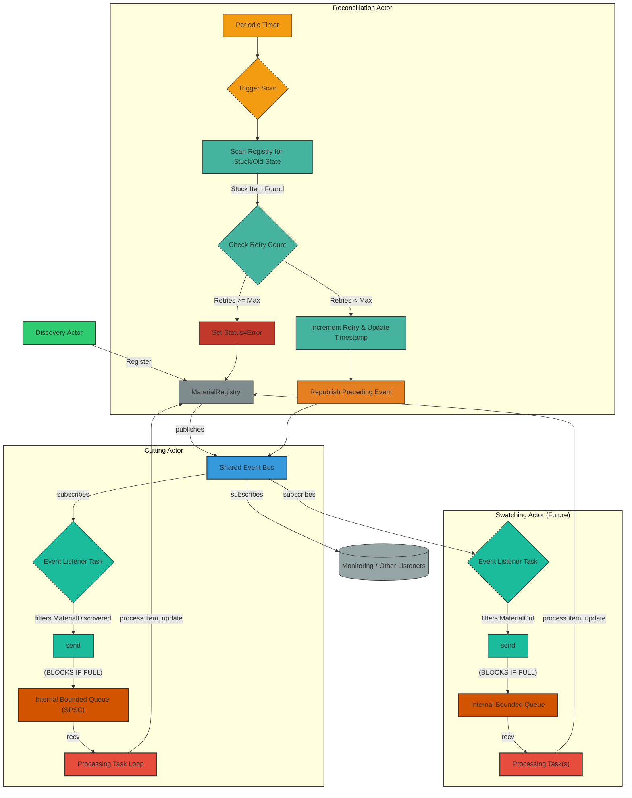

# Quilt Architecture – Event-Driven Actor Model with Internal Backpressure and Material Registry

This document describes the architecture for Quilt—a local-first, modular memory and context engine. This architecture uses an event-driven approach with Actix and Tokio, incorporating an internal queue mechanism within actors for effective backpressure management, alongside a central Material Registry for state coordination. Communication between stages occurs via a single, shared `EventBus`.

---

## High-Level Workflow

Materials flow through a pipeline of independent processing stages, communicated via a central `EventBus`:

1.  **Discovery Stage:**

    - The `Discovery Actor` monitors input sources.
    - Upon finding new/updated material, it registers it with the `MaterialRegistry`.
    - The `MaterialRegistry` persists the material state and publishes a `MaterialDiscovered` event onto the central `EventBus`.

2.  **Cutting Stage:**

    - The `Cutting Actor` subscribes to the central `EventBus`.
    - Its internal listener filters for `MaterialDiscovered` events.
    - It uses an internal queue to buffer these events and manage load.
    - It processes materials from its queue sequentially, performing cutting logic.
    - Upon completion, it updates the `MaterialRegistry`.
    - The `MaterialRegistry` persists the new state and publishes a `MaterialCut` event onto the _same_ central `EventBus`.

3.  **Swatching Stage (Future):**

    - The `Swatching Actor` system subscribes to the central `EventBus`.
    - Its internal listener filters for `MaterialCut` events.
    - It uses an internal queue to buffer these events.
    - It processes items from its queue, potentially using concurrent futures for embedding.
    - Upon completion, it updates the `MaterialRegistry`.
    - The `MaterialRegistry` persists the state and publishes a `MaterialSwatched` event onto the central `EventBus`.

4.  **Reconciliation Stage:** A dedicated `Reconciliation Actor` periodically scans the `MaterialRegistry`. If it finds materials stuck in an intermediate state (e.g., `Cutting`) for too long, it increments a retry counter. If retries remain, it re-publishes the preceding event (e.g., `MaterialDiscovered`) to trigger the stage again. If max retries are exceeded, it moves the material to an `Error` state.

Backpressure _within_ each stage is handled by the actor's internal bounded queue. Handling _sustained_ overload where the queue remains full requires careful consideration (see Backpressure Management section).

---

## Architecture Diagram: Single Event Bus & Internal Actor Queue with Reconciliation

This diagram includes the `Reconciliation Actor` performing periodic checks and potentially re-triggering stages.



**Key Components & Flow:**

1.  **Shared Event Bus (`broadcast::channel`):** A single bus used for all inter-stage event communication. Ensures loose coupling and allows central monitoring.
2.  **Actor Subscription:** Actors (`CuttingActor`, `SwatchingActor`) `subscribe()` to this single `EventBus`.
3.  **Listener Task (within Actor):** A dedicated Tokio task receives _all_ events from the bus. It must **filter** events, processing only those relevant to its stage (e.g., `CuttingActor` listener looks for `MaterialDiscovered`). Spawned via `ctx.spawn().into_actor(self)`.
4.  **Internal Queue (`mpsc::channel`):** A bounded SPSC channel owned by the actor. The Listener Task produces relevant, filtered events onto this queue.
5.  **Enqueueing Work:** The Listener Task `send`s filtered `WorkItem`s to the `InternalQueue`.
6.  **Backpressure Point:** If the `InternalQueue` is full, the `work_sender.send(item).await` call **blocks** the Listener Task. This stops the listener from reading further events from the Event Bus immediately.
7.  **Processor Task (within Actor):** A separate Tokio task owns the `Receiver` and processes items from the `InternalQueue`.
8.  **Processing:** The Processor Task executes stage-specific logic. Consider `spawn_blocking` for CPU-bound work.
9.  **Concurrency (Optional):** The `SwatchingActor`'s Processor Task can use `for_each_concurrent` for parallelism.
10. **Registry Update & Event Publishing:** The Processor Task updates the `MaterialRegistry`, which publishes the next event onto the _same shared_ `EventBus`.
11. **Reconciliation Actor (Periodic Scan):** A dedicated `Reconciliation Actor` periodically scans the `MaterialRegistry`.
12. **Detecting Stuck Items:** It identifies materials that have been in an intermediate state (e.g., `Cutting`, `Swatching`) for longer than a defined timeout, using a `last_status_update` timestamp stored with the material.
13. **Retry Mechanism:** For stuck items, the `Reconciliation Actor` increments a `retry_count` (also stored with the material). If the count is below a threshold (`max_retries`):
    - It updates the `retry_count` and `last_status_update` timestamp in the Registry.
    - It re-publishes the event required to trigger the stuck stage again (e.g., `MaterialDiscovered` if stuck in `Cutting`) onto the shared `EventBus`.
14. **Max Retries:** If `retry_count` reaches `max_retries`, the `Reconciliation Actor` updates the material's status to `Error` in the `MaterialRegistry`.
15. **Idempotency Requirement:** Processing actors (`CuttingActor`, `SwatchingActor`) must be idempotent. When receiving an event (potentially a retry), they should check the material's current status in the Registry and avoid reprocessing if already successfully completed, or handle the retry appropriately.

---

## Component Details

### Actors (`DiscoveryActor`, `CuttingActor`, `SwatchingActor`, `ReconciliationActor`)

- **Role:** Encapsulate stage logic (`Discovery`, `Cutting`, `Swatching`) or coordination/recovery logic (`Reconciliation`). Actors are independent processors subscribing to relevant events.
- **Implementation:** Primarily `actix::Actor`. Processing actors (`Cutting`, `Swatching`) manage internal queues as described above. `ReconciliationActor` contains timed scanning logic, state checking, retry counting, and event re-publishing logic.
- **Communication:** Primarily via subscribing to the shared `EventBus` (filtering relevant events) and interacting with the `MaterialRegistry`. The Registry publishes primary events, while the `ReconciliationActor` may re-publish events for retries.
- **Individual Actor Details:**
  - **Discovery Actor:**
    - **Role:** Continuously monitors input sources (e.g., folders) for new or updated materials.
    - **Behavior:** When a new material is detected, it registers it with the Registry, which handles persistence and event publishing.
    - **Implementation:** Typically an asynchronous task (could be an Actix actor or a standalone Tokio task) that listens for file system changes or other triggers.
  - **Cutting Actor:**
    - **Role:** Processes materials into cuts based on `MaterialDiscovered` events.
    - **Behavior:** Subscribes to `MaterialDiscovered`, filters them via its listener task, enqueues them internally, processes cuts from the queue, and updates material status via the Registry.
    - **Implementation:** Event-driven Actix actor implementing the internal queue pattern.
  - **Swatching Actor (Future):**
    - **Role:** Creates swatches from cut materials based on `MaterialCut` events.
    - **Behavior:** Subscribes to `MaterialCut`, filters, enqueues internally, performs embedding operations (potentially concurrently from the queue), and updates material status via the Registry.
    - **Implementation:** Event-driven Actix actor implementing the internal queue pattern, potentially with concurrent processing from its internal queue.
  - **Reconciliation Actor:**
    - **Role:** Monitors the system for materials stuck in intermediate processing states and attempts recovery or marks them as errors.
    - **Behavior:** Periodically scans the Registry, checks timestamps and retry counts, re-publishes events for retries, or updates status to `Error`.
    - **Implementation:** Actix actor driven by a timer (`ctx.run_interval`).

### Event Bus (`tokio::sync::broadcast`)

- **Role:** Decouple all stages and observers. Enables loose coupling and extensibility.
- **Implementation:** Single Tokio broadcast channel instance shared across the system (e.g., via `Arc` or Actix `Data`).
- **Capacity:** Size appropriately for peak _total_ event volume and slowest listener lag. Needs careful tuning.

### Internal Queue (`tokio::sync::mpsc`)

- **Role:** Buffer stage-specific work within processing actors, provide backpressure within the actor.
- **Implementation:** Bounded Tokio MPSC channel used typically in SPSC mode within each processing actor (`CuttingActor`, `SwatchingActor`).
- **Capacity:** Stage-specific tuning parameter (e.g., 16-64). Key point for backpressure management.

### Material Registry

- **Role:** Central state coordinator, persistence manager, event publisher. Acts as the single source of truth for material state (`status`, `last_status_update`, `retry_count`).
- **Responsibilities:** Coordinate with Repository for persistence, publish state change events to the shared `EventBus`, enforce idempotence (only one state transition per material per event), maintain consistency between state, persistence, and events.
- **Implementation:** Thread-safe service (e.g., using `Arc<RwLock<...>>` or an actor itself) that interacts with the `MaterialRepository` and publishes events to the shared `EventBus`.

### Material Repository

- **Role:** Handles persistence of materials and their state.
- **Responsibilities:** Save and load materials, handle persistence errors, provide atomic storage operations.
- **Implementation:** A trait that can be implemented for different storage backends (e.g., SQLite, filesystem).

  ```rust
  use async_trait::async_trait;
  use anyhow::Result; // Or your project's preferred Result type

  // Assuming a Material struct exists
  pub struct Material {
      pub id: String,
      // ... other fields
  }

  #[async_trait]
  pub trait MaterialRepository: Send + Sync + 'static {
      async fn save(&self, material: &Material) -> Result<()>;
      async fn load(&self, id: &str) -> Result<Option<Material>>;
      // May need methods to update status, timestamp, retry_count specifically
      // async fn update_status(&self, id: &str, status: MaterialStatus, timestamp: OffsetDateTime) -> Result<()>;
      // async fn increment_retry_count(&self, id: &str, timestamp: OffsetDateTime) -> Result<()>;
      async fn delete(&self, id: &str) -> Result<()>;
  }
  ```

---

## Threading Model (Actix + Tokio)

1.  **Tokio Runtime:** Actix uses a Tokio multi-threaded runtime, managing a pool of worker threads.
2.  **Actix Actors:** Actors run within an Actix `Context`. Message handlers execute as tasks on the Tokio runtime.
3.  **Internal Tasks:** The Listener and Processor tasks spawned within an actor (using `ctx.spawn().into_actor(self)` or similar methods) are independent Tokio tasks scheduled on the runtime's worker threads.
4.  **Concurrency:** The Listener and Processor tasks run concurrently _within_ the actor's logical scope. Backpressure between them occurs via the bounded `mpsc` channel. Other actors run concurrently with each other.
5.  **State Access:** Access to shared actor state from internal tasks requires synchronization (e.g., `Arc<Mutex<_>>`) or sending messages back to the actor if contention or complex logic is involved. Access to the `MaterialRegistry` or `MaterialRepository` also requires appropriate synchronization (e.g., `RwLock`, actor messages, or connection pooling for databases).

---

## Event Types

The system uses domain events for communication. Events represent system state changes and drive processing.

```rust
use time::OffsetDateTime; // Example time library
use thiserror::Error; // Example error handling library
use std::path::PathBuf;
use std::sync::Arc;

/// Material ID type for improved type safety
#[derive(Debug, Clone, PartialEq, Eq, Hash)]
pub struct MaterialId(String);

// Example simplified Material Status
#[derive(Debug, Clone, PartialEq, Eq)]
pub enum MaterialStatus {
    Discovered,
    Cutting,
    Cut,
    Swatching,
    Swatched,
    Error,
}

#[derive(Debug, Clone)]
pub enum ProcessingStage {
    Discovery,
    Cutting,
    Swatching,
    Reconciliation,
}

// --- Material Events ---

#[derive(Debug, Clone)]
pub struct MaterialDiscoveredEvent {
    pub material_id: MaterialId,
    pub file_path: PathBuf, // Using PathBuf for clarity
    pub discovered_at: OffsetDateTime,
}

#[derive(Debug, Clone)]
pub struct MaterialCutEvent {
    pub material_id: MaterialId,
    pub cut_ids: Vec<String>, // Example, depends on cutting logic
    pub cut_at: OffsetDateTime,
}

#[derive(Debug, Clone)]
pub struct MaterialSwatchedEvent {
    pub material_id: MaterialId,
    pub swatch_id: String, // Example, depends on swatching logic
    pub swatched_at: OffsetDateTime,
}

// --- System Events ---

#[derive(Debug, Clone)]
pub enum SystemEvent {
    /// Actor health check request/response (could be more specific)
    HealthCheck { actor_id: String, status: String },
    /// Graceful shutdown signal
    Shutdown,
    // Other system-level events (config change, etc.)
}

// --- Error Events ---

#[derive(Debug, Clone, Error)]
pub enum ProcessingError {
    #[error("Cutting failed for {material_id}: {source}")]
    Cutting { material_id: MaterialId, source: Arc<anyhow::Error> }, // Using Arc<anyhow::Error> for cheap cloning
    #[error("Swatching failed for {material_id}: {source}")]
    Swatching { material_id: MaterialId, source: Arc<anyhow::Error> },
    #[error("Persistence failed for {material_id} during {operation}: {source}")]
    Persistence { material_id: MaterialId, operation: String, source: Arc<anyhow::Error> },
    #[error("Reconciliation failed for {material_id}: {reason}")]
    Reconciliation { material_id: MaterialId, reason: String },
     #[error("Discovery failed for path {path:?}: {source}")]
    Discovery { path: Option<PathBuf>, source: Arc<anyhow::Error> },
}

#[derive(Debug, Clone)]
pub struct MaterialProcessingErrorEvent {
    pub error: ProcessingError,
    pub error_at: OffsetDateTime,
}


/// Event indicating a stage may have missed events due to lag or the Reconciliation actor needs to run
#[derive(Debug, Clone)]
pub struct ReconciliationNeededEvent {
    pub stage: ProcessingStage,      // Which stage detected the lag or context
    pub details: Option<String>,     // Optional details
    pub timestamp: OffsetDateTime,
}

// --- Main Event Enum ---

/// Represents all possible events flowing through the shared Event Bus.
#[derive(Debug, Clone)]
pub enum QuiltEvent {
    MaterialDiscovered(MaterialDiscoveredEvent),
    MaterialCut(MaterialCutEvent),
    MaterialSwatched(MaterialSwatchedEvent),
    System(SystemEvent),
    ProcessingError(MaterialProcessingErrorEvent),
    ReconciliationNeeded(ReconciliationNeededEvent),
}

// --- Constructors (Optional but helpful) ---

impl QuiltEvent {
    pub fn material_discovered(material_id: MaterialId, file_path: PathBuf) -> Self {
        Self::MaterialDiscovered(MaterialDiscoveredEvent {
            material_id,
            file_path,
            discovered_at: OffsetDateTime::now_utc(),
        })
    }

    pub fn material_cut(material_id: MaterialId, cut_ids: Vec<String>) -> Self {
        Self::MaterialCut(MaterialCutEvent {
            material_id,
            cut_ids,
            cut_at: OffsetDateTime::now_utc(),
        })
    }

     pub fn material_swatched(material_id: MaterialId, swatch_id: String) -> Self {
        Self::MaterialSwatched(MaterialSwatchedEvent {
            material_id,
            swatch_id,
            swatched_at: OffsetDateTime::now_utc(),
        })
    }

    pub fn processing_error(error: ProcessingError) -> Self {
        Self::ProcessingError(MaterialProcessingErrorEvent {
             error,
             error_at: OffsetDateTime::now_utc(),
         })
    }

    pub fn reconciliation_needed(stage: ProcessingStage, details: Option<String>) -> Self {
        Self::ReconciliationNeeded(ReconciliationNeededEvent {
            stage,
            details,
            timestamp: OffsetDateTime::now_utc(),
        })
    }

    // ... constructors for other event types ...
}


```

---

## Concurrency and Backpressure Summary

- **Inter-Stage Communication:** Decoupled via single shared broadcast `EventBus`. Events published by the Registry after successful state changes/persistence or by Reconciliation actor.
- **Intra-Actor Work Management:** Handled by the internal bounded `mpsc` (SPSC) queue within processing actors; requires filtering incoming events in the dedicated listener task.
- **Backpressure:** Primarily occurs when the Listener task blocks on `send().await` to a full internal queue. This provides immediate relief within the actor but can lead to the listener lagging behind the shared `EventBus`.
- **Sustained Overload / Event Loss:** If the internal queue _stays_ full, the listener _will_ lag on the broadcast bus. Exceeding the broadcast buffer capacity results in `RecvError::Lagged` and permanent event loss _from the broadcast_ for that specific actor's subscription. The Reconciliation actor is crucial for mitigating the impact of such lost events.
- **Handling Stuck Items:** The `Reconciliation Actor` periodically scans for items stuck in intermediate states (due to processing errors, lost events, or crashes) based on timestamps and status.
- **Retry Logic:** Stuck items are retried by re-publishing the preceding event (e.g., `MaterialDiscovered`), up to a maximum retry count stored in the Registry.
- **Error State:** Items exceeding max retries are moved to an `Error` state by the Reconciliation Actor.
- **Idempotency:** Processing actors (`Cutting`, `Swatching`) must be idempotent. They need to handle receiving the same event multiple times (due to retries) by checking the current material state in the Registry before processing.

---

## Implementation with Tokio and Actix

This section outlines idiomatic approaches for implementing the Quilt architecture using Tokio and Actix.

### Actor System Implementation

Our architecture combines Actix for actor management with Tokio for the async runtime and concurrency primitives:

1.  **Actix for Actor Lifecycle & Messaging:**

    - Each processing unit (`Discovery`, `Cutting`, `Swatching`, `Reconciliation`) is implemented as an Actix actor (`actix::Actor`).
    - Use `Actor` trait lifecycle hooks (`started`, `stopping`, `stopped`).
    - Define messages using the `#[derive(Message)]` macro with appropriate `Result` types.
    - Implement `Handler<M>` for each message the actor needs to process. Use `ResponseFuture` or `async move` blocks within handlers for asynchronous logic.
    - Use `Context<Self>` (`ctx`) for spawning internal tasks (`ctx.spawn`, `ctx.run_interval`), managing address (`ctx.address()`), stopping (`ctx.stop()`).

2.  **Tokio for Concurrency Primitives:**
    - **Event Bus:** Use `tokio::sync::broadcast::channel` for the shared `EventBus`. Share the `Sender` (e.g., wrapped in `Arc` or `Data`) with components that need to publish (Registry, Reconciliation Actor). Actors subscribe using `sender.subscribe()`.
    - **Internal Queues:** Use `tokio::sync::mpsc::channel` for the bounded queues inside processing actors. The actor holds the `Sender` and `Receiver`.
    - **Shared State:** Use `tokio::sync::RwLock` or `tokio::sync::Mutex` for protecting shared data within the Registry or if actors need direct access to shared resources (prefer message passing where possible). Wrap shared state in `Arc`.
    - **Async I/O:** Use `tokio::fs`, `tokio::net`, etc., for non-blocking I/O operations.
    - **Timeouts/Delays:** Use `tokio::time::{sleep, timeout}`.
    - **CPU-Bound Work:** Offload blocking or CPU-intensive work using `tokio::task::spawn_blocking`.

### Event Bus Implementation Details

1.  **Single Shared Channel:** Create one `broadcast::channel` instance at application startup.
2.  **Sharing:** Wrap the `Sender<QuiltEvent>` in `Arc` or Actix `Data` and inject it into the `MaterialRegistry` and `ReconciliationActor`.
3.  **Subscription:** Actors needing to listen subscribe via `sender.subscribe()` during their `started` lifecycle hook. Each subscription gets an independent `Receiver`. Store the `Receiver` in the actor's state.
4.  **Listener Task:** In processing actors (`Cutting`, `Swatching`), spawn a dedicated task (e.g., using `ctx.spawn`) in `started` that loops on `receiver.recv()`. This task filters relevant events and `sends` them to the actor's internal `mpsc` queue. Handle `RecvError::Lagged` appropriately (e.g., log, potentially signal reconciliation).
5.  **Publishing:** The `MaterialRegistry` calls `sender.send(event).ok()` after successful state updates/persistence. The `ReconciliationActor` calls `sender.send(event).ok()` when re-publishing for retries. Ignore the send result if no subscribers exist.

### Material Registry Implementation

1.  **State Management:** Can be an Actor itself or a thread-safe struct (`Arc<RwLock<RegistryState>>`). Needs access to the `MaterialRepository` trait object and the `EventBus` `Sender`.
2.  **Atomicity:** Operations like registering a material should ideally involve:
    - Locking state (if using `RwLock`).
    - Calling `repository.save(...)`.
    - Updating in-memory state (status, timestamp).
    - Publishing the corresponding event (`sender.send(...)`).
    - Unlocking state.
      Error handling is critical at each step. Consider transactional patterns if the repository supports them.
3.  **Idempotency Checks:** Methods need to check current state before performing actions (e.g., don't re-discover if already `Discovered` or beyond).

### Actor Implementation Patterns

1.  **Discovery Actor:**

    - Can be simpler if it only _detects_ and _registers_. Might use `tokio::fs::watch` (if applicable) or periodic scanning in an async loop (`tokio::time::interval`).
    - On detection, sends a message/calls a method on the `MaterialRegistry` to register the material.

2.  **Processing Actors (Cutting, Swatching):**

    - **`started` hook:** Subscribe to `EventBus`, get internal `mpsc` channel pair, spawn the Listener task, spawn the Processor task.
    - **Listener Task:** Loop `event_bus_rx.recv()`, filter events, `internal_queue_tx.send(work_item).await`. Handle lag.
    - **Processor Task:** Loop `internal_queue_rx.recv()`, perform stage logic (e.g., cutting, embedding), interact with Registry (e.g., call `registry.update_status(...)` via messages or async methods). Use `spawn_blocking` if needed.

3.  **Reconciliation Actor:**
    - **`started` hook:** Use `ctx.run_interval` to trigger a periodic check message to itself.
    - **Handler for Check Message:** Scan the `MaterialRegistry` (potentially querying the `MaterialRepository` directly for performance) for items stuck in intermediate states past a timeout.
    - For stuck items: Check `retry_count`. If retries remain, increment count via Registry/Repository and re-publish the _preceding_ event to the `EventBus`. If max retries reached, update status to `Error` via Registry/Repository.

### Concurrency Safety

1.  **Thread-Safe State:** Use `Arc<RwLock<T>>` or `Arc<Mutex<T>>` for any state shared between actors or tasks (like the Registry state if not an actor). Prefer `RwLock` for read-heavy access.
2.  **Message Passing:** Prefer inter-actor communication via messages for safety and to avoid complex locking. Actors handle messages sequentially (per actor instance).
3.  **Repository Safety:** Ensure the `MaterialRepository` implementation is thread-safe (e.g., using `sqlx`'s connection pool).
4.  **Event Publishing:** Publish events _after_ the corresponding state change is successfully persisted to avoid inconsistent states if publishing fails.

---

## Future Scaling Proposals

The event-driven architecture enables several scaling patterns:

1.  **Parallel Processing Actors:**

    - Run multiple instances of `CuttingActor` or `SwatchingActor`.
    - The `EventBus` (broadcast channel) naturally distributes events to all subscribers.
    - Each actor instance maintains its own internal queue for backpressure.
    - Requires careful state management in the `MaterialRegistry` to handle concurrent updates for the same material ID (e.g., using atomic updates or optimistic locking if needed, though the sequential nature of events helps).

2.  **Adding New Processing Stages:**

    - Create a new Actor (e.g., `AnalyticsActor`).
    - Have it subscribe to the relevant events on the shared `EventBus`.
    - No changes needed to existing actors.

3.  **Enhanced Monitoring:**

    - Create a dedicated `MonitoringActor`.
    - Subscribe to _all_ events on the `EventBus`.
    - Collect metrics (event counts, processing times inferred from event timestamps), track material flow, detect error patterns.

4.  **Repository Scaling:**

    - Choose a `MaterialRepository` implementation that scales (e.g., a scalable database).
    - Implement caching within the `MaterialRegistry` to reduce repository load.

5.  **Event Bus Alternatives (If Broadcast Becomes Bottleneck):**
    - For very high scale, consider dedicated queues (e.g., Kafka, Redis Streams) instead of or alongside the in-memory broadcast channel, though this adds complexity.

These improvements can be implemented incrementally.

---

## Open Questions and Considerations

This consolidated list includes questions relevant to both the general architecture and the specific backpressure/reconciliation mechanisms:

1.  **Actor Recovery and Supervision:**

    - How should individual actors handle internal panics or unrecoverable errors? (Restart strategies via supervisor?)
    - What is the overall supervision strategy? (Actix provides some basic supervision).
    - Should we implement circuit breakers for external dependencies (e.g., embedding models)?

2.  **Event Ordering and Consistency:**

    - Does the system require strict event ordering across different material types? (Usually handled by sequential processing per material).
    - How to handle potential inconsistencies if a state update succeeds but event publishing fails? (Retry publishing? Reconciliation catch?)
    - Event versioning if event schemas evolve significantly?

3.  **Backpressure Tuning & Strategy:**

    - Optimal sizes for internal `mpsc` queues per actor?
    - Optimal capacity for the shared `broadcast` Event Bus?
    - Strategy for _sustained_ overload where internal queues remain full and `RecvError::Lagged` occurs frequently? (Alerting? Dropping work intentionally? Dynamic scaling?)

4.  **Reconciliation Logic:**

    - Appropriate timeouts for detecting stuck states per stage?
    - Reasonable `max_retries` value?
    - Optimal frequency for the `Reconciliation Actor` scan? (Balance between responsiveness and load).
    - Should the scan query the Repository directly or rely on Registry state? (Performance vs. consistency).
    - Should reconciliation perform external checks (e.g., filesystem)?

5.  **State Recovery (Application Crash):**

    - How is `MaterialRegistry` state (including `last_status_update`, `retry_count`) recovered after an application crash? (Reliant on `MaterialRepository` persistence).
    - Ensure repository writes are durable.
    - Consider event sourcing for the Registry state as an alternative recovery mechanism? (More complex).

6.  **Performance Optimization:**

    - Optimizing the Registry scan performed by the `Reconciliation Actor` (e.g., indexing in the repository).
    - Batching operations within actors or the repository?
    - Memory usage of actors, queues, and the registry state.
    - Optimizing CPU-bound work (embedding, cutting logic).

7.  **Monitoring and Observability:**

    - Key metrics: Internal queue depths, event bus listener lag (`Lagged` errors), `retry_count` values, frequency of retries, transitions to `Error` state, processing times per stage.
    - Tracing event flow across actors.
    - Effective health checks for each actor and the system.

8.  **Idempotency Implementation:**

    - Ensuring robust and efficient idempotency checks in processing actors (checking Registry state before acting).

9.  **Configuration Management:**
    - How to manage configuration for timeouts, `max_retries`, scan intervals, queue/buffer sizes, repository connections, etc.? (Environment variables, config files?).
    - Handling dynamic configuration updates?

---

## Final Thoughts

This architecture uses idiomatic Rust with Actix and Tokio to create a robust, event-driven system. It prioritizes:

- **Loose Coupling:** Actors interact primarily through the shared `EventBus` and `MaterialRegistry`.
- **Backpressure:** Internal queues provide per-actor load management.
- **Resilience:** The `Reconciliation Actor` adds a layer of recovery for stuck processing.
- **Extensibility:** New processing stages or monitors can be added easily by subscribing to the `EventBus`.
- **Testability:** Individual actors and the Registry can be tested more easily due to clear boundaries.
- **State Consistency:** The `MaterialRegistry` acts as the central coordinator for state.

The combination of a shared event bus, internal actor queues for backpressure, and a dedicated reconciliation mechanism provides a flexible and resilient foundation for Quilt, capable of handling asynchronous workflows while managing load and recovering from transient issues. Key challenges lie in tuning the backpressure mechanisms, implementing robust state management and recovery, and ensuring effective monitoring.
