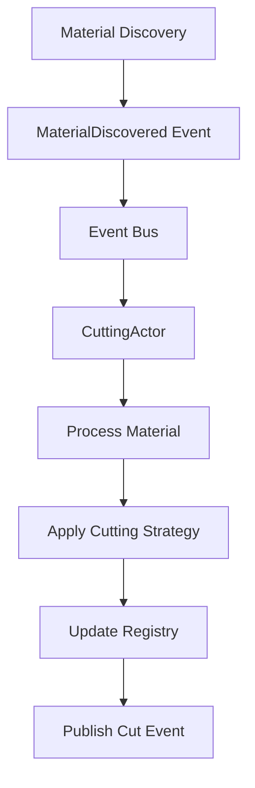
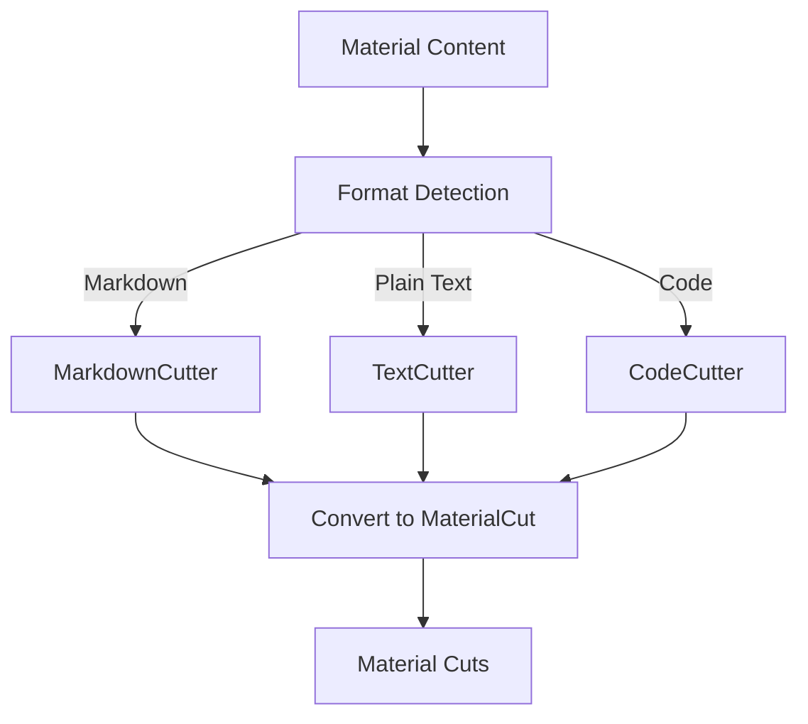
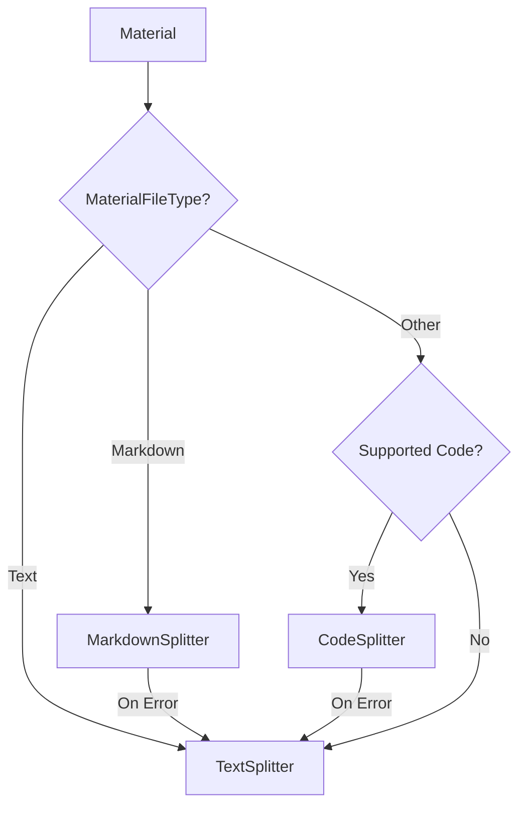
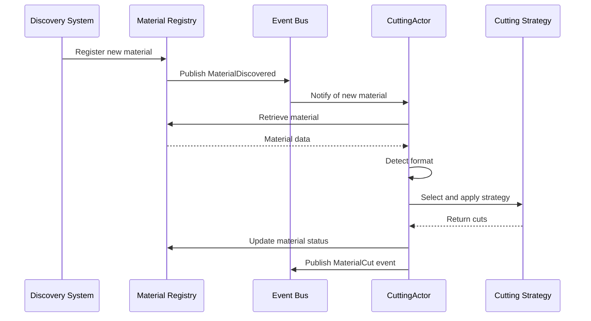

# Material Cutting

This document outlines how Quilt extracts meaningful Cuts from source Materials using an event-driven, actor-based architecture and the text-splitter crate.

## Architecture Overview

Quilt uses an actor-based approach with Actix to handle material cutting operations:



## System Components

### CuttingActor

- Subscribes to MaterialDiscovered events through a broadcast channel
- Processes discovered materials asynchronously
- Selects appropriate cutting strategy based on content type
- Updates material status in the registry
- Maintains isolation through message passing
- Handles failures and publishes error events

### Material Registry

- Stores the state of all materials
- Tracks material processing status
- Provides access to material content
- Updates material metadata during processing
- Serves as the source of truth for material state

### Event System

- Broadcasts material lifecycle events
- Uses Tokio broadcast channels for pub/sub
- Enables loose coupling between system components
- Supports multi-subscriber pattern
- Provides guaranteed delivery to active subscribers

## Cutting Strategies

Quilt uses the text-splitter crate to handle the complex task of chunking different content types semantically:



### Division of Responsibilities

#### Quilt Handles:

- **Format Detection** - Determining content type from file extension and content sampling
- **Splitter Selection** - Instantiating the appropriate text-splitter type
- **Configuration** - Setting appropriate chunk sizes based on our requirements
- **Cut Production** - Converting text-splitter chunks to our MaterialCut model
- **Error Handling** - Managing and reporting issues during the cutting process
- **Context Preservation** - Maintaining metadata about the source material

#### text-splitter Provides:

- **Semantic Chunking** - Splitting content at natural boundaries
- **Content-Aware Processing** - Using specialized strategies for text, markdown, and code
- **Size Management** - Respecting target/min/max chunk sizes
- **Hierarchical Processing** - Using the highest semantic level that fits in a chunk

### Splitter Selection Architecture

Quilt uses a type-based approach for selecting the appropriate text-splitter:



This architecture:

1. Uses file extension via MaterialFileType as the primary signal
2. Falls back to TextSplitter for unsupported formats
3. Handles errors gracefully by defaulting to the most robust implementation

## Cutting Process Flow

The process of creating cuts follows this asynchronous sequence:



## Message Types

The CuttingActor handles several message types:

1. **ProcessDiscoveredMaterial** - Internal message to process a discovered material
2. **Ping** - Health check message
3. **Shutdown** - Signal to gracefully shut down

## Error Handling

Errors during cutting are handled through the event system with a progressive fallback approach:

1. Specialized strategies (Markdown, Code) are tried first
2. If these fail, the system falls back to simpler text-based cutting
3. If all cutting strategies fail, the error is logged and published as an event
4. The material status is updated to reflect the error
5. The process continues with the next material

See [Cut Error Handling](./cut-errors.md) for details on error types and recovery strategies.

## Configuration

Quilt configures text-splitter with sensible defaults:

```
Target size: 300 tokens
Minimum size: 150 tokens
Maximum size: 800 tokens
```

These values are used for all splitter types to maintain consistency.

## Semantic Levels

Each splitter type provided by text-splitter handles different semantic boundaries:

### TextSplitter

- Characters → Graphemes → Words → Sentences → Newlines

### MarkdownSplitter

- Adds: Soft breaks → Inline elements → Block elements → Headings

### CodeSplitter

- Adds: Function boundaries → Class boundaries → Syntax tree depth

## Material States

Materials progress through the following states during cutting:

1. **Discovered** - Initial state when a material is found
2. **Processing** - Currently being processed by the CuttingActor
3. **Cut** - Successfully processed with cuts created
4. **Error** - Failed to process due to an error

## Implementation Status

The CuttingActor is implemented with:

- ✅ Event subscription
- ✅ Asynchronous processing
- ✅ Material registry integration
- ✅ Error event publishing
- 🔄 Multiple cutting strategies (under development)
- 🔄 Format-specific processing (under development)

## Future Enhancements

- **Token-based sizing** - Using AI model-specific tokenizers for more accurate chunk sizing
- **Custom splitters** - Creating specialized splitters for formats not covered by text-splitter
- **Language-specific heuristics** - Enhancing code chunking for specific programming languages
- **Context preservation** - More sophisticated methods for maintaining cross-cut relationships
- **Parallel processing** - Multi-threaded cutting for large document collections
