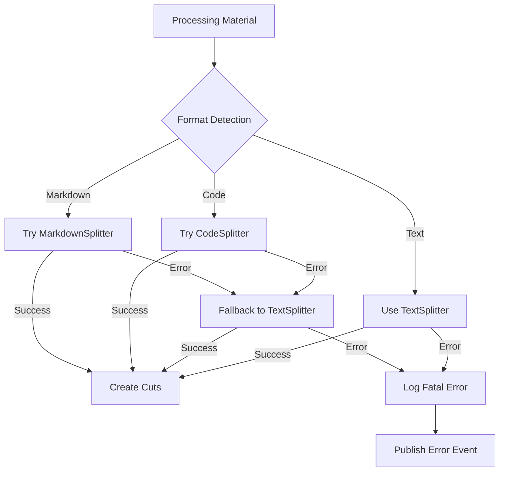
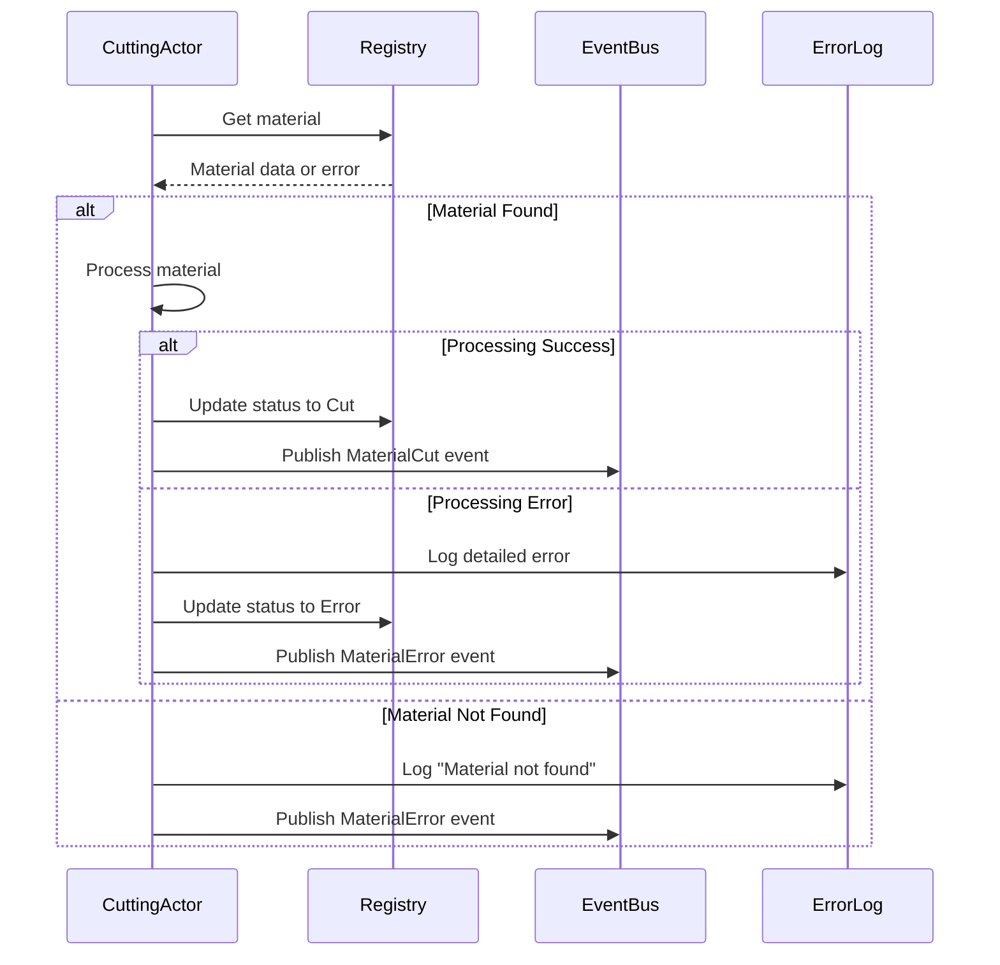

# Cut Error Handling

This document describes how the Quilt cutting system detects, reports, and handles errors during Material processing.

## Error Structure

```rust
/// Cutting operation errors
#[derive(Debug, Error)]
pub enum CuttingError {
    /// Material not found error
    #[error("Material not found: {0}")]
    MaterialNotFound(MaterialId),

    /// Generic cutting error
    #[error("Cutting operation failed: {0}")]
    OperationFailed(String),
}

/// Possible errors during text-splitter operations
#[derive(Debug)]
pub enum CutError {
    /// Failed to read material file
    IoError(io::Error),

    /// Failed to parse content
    ParseError(String),

    /// No meaningful cuts could be identified
    BoundaryError(String),

    /// File format not supported for cutting
    UnsupportedFormat(String),

    /// A strategy was specified but unavailable
    StrategyUnavailable(String),
}
```

## Error Categories

| Error Type           | Description                        | Handling                                 | Recovery                         |
| -------------------- | ---------------------------------- | ---------------------------------------- | -------------------------------- |
| Material Not Found   | Material ID not in registry        | Log error, publish error event           | Retry discovery                  |
| Operation Failed     | Processing failed with details     | Log error with context, update status    | Depends on failure type          |
| Content Access       | Cannot read material content       | Log IO error details, update status      | Fix permissions or file location |
| Format Detection     | Cannot determine content type      | Default to TextSplitter                  | Use explicit format hint         |
| Splitter Creation    | Cannot create specialized splitter | Fall back to TextSplitter                | Check text-splitter dependencies |
| Empty Results        | No cuts produced                   | Return error with diagnostic information | Adjust chunk size parameters     |
| Chunking Errors      | text-splitter internal errors      | Capture and wrap as CutError::ParseError | Try alternative splitter         |
| Processing Exception | Runtime error during cutting       | Capture exception, publish error event   | Adjust processing strategy       |
| Timeout              | Processing took too long           | Cancel operation, log timeout            | Retry with different parameters  |

## Progressive Fallback Approach

The Quilt cutting system uses a progressive fallback approach to maximize success:



This approach:

1. Begins with the most appropriate strategy for the content type
2. Falls back to simpler strategies if specialized ones fail
3. Uses TextSplitter as the most robust fallback option
4. Only if all strategies fail is an error published

## Event-Driven Error Flow

The CuttingActor integrates error handling into its event-driven workflow:



## Error Information

When a cutting error occurs, the following information is captured:

1. Material ID - Unique identifier of the material
2. Error Type - Category of the error
3. Error Message - Human-readable description
4. Context - Additional information about the error
5. Timestamp - When the error occurred
6. Severity - How critical the error is
7. Strategy Used - Which cutting strategy was attempted

## Error Publishing

Errors are published to the event bus using a MaterialProcessingError event:

```rust
// Example event creation for a processing error
let error_event = QuiltEvent::create_processing_error_event(
    material_id.as_str(),
    ProcessingStage::Cutting,
    &format!("Material not found during cutting stage: {}", material_id.as_str()),
);

registry.event_bus().publish(error_event)?;
```

## System Design Principles

- **Surface errors early**: Feedback provided during or immediately after processing
- **Inform downstream systems**: Events published for appropriate handling
- **Log everything**: Errors are stored with detailed context
- **Make it fixable**: Error messages include actionable information
- **Retry is built-in**: Materials can be reprocessed after errors
- **Recover automatically**: Fall back to simpler strategies when possible

## System Resilience

The combination of actor-based architecture and progressive fallback strategies provides resilience through:

1. **Message Isolation** - Each message is processed independently
2. **Supervisor Strategies** - Actors can be restarted if they fail
3. **Event Broadcasting** - Multiple subscribers can react to errors
4. **State Preservation** - Material registry maintains consistent state
5. **Error Boundaries** - Errors are contained within specific actors
6. **Strategy Degradation** - Simpler processing methods used when needed
