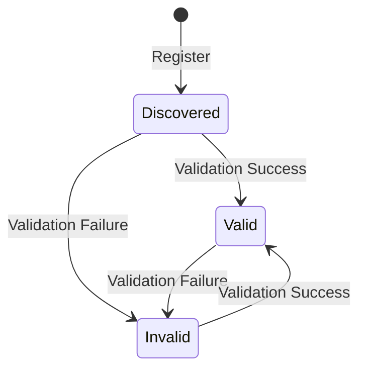
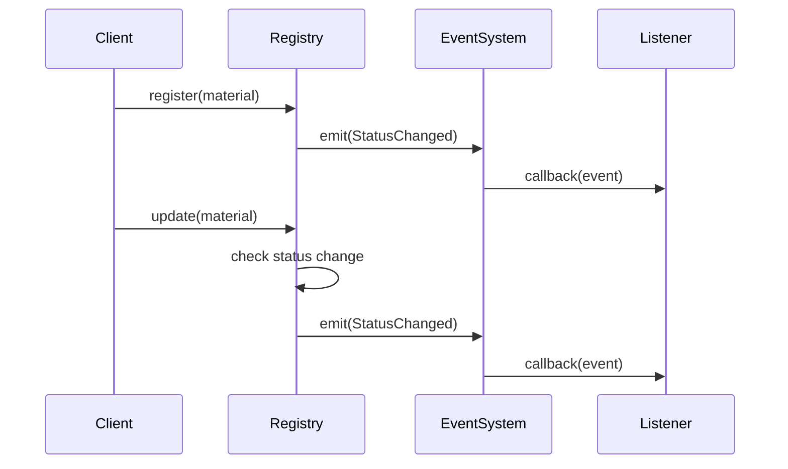

# Quilt Material Ingestion Architecture

This document outlines the high-level architecture of Quilt's Markdown-only material ingestion pipeline. The system is designed to be reactive and event-driven, with the **Material Registry** acting as both the state store and the event emitter.

## Current Implementation

### Material Types

```rust
/// A Material represents a Markdown file in Quilt
pub struct Material {
    pub id: String,          // CUID for unique identification
    pub file_path: String,   // Path to the file
    pub file_type: MaterialFileType,
    pub ingested_at: OffsetDateTime,
    pub status: MaterialStatus,
    pub error: Option<String>,
}

/// The possible states of a material
pub enum MaterialStatus {
    Discovered,  // Initial state
    Valid,       // Passed validation
    Invalid,     // Failed validation
}

/// Events emitted during material processing
pub enum MaterialEvent {
    StatusChanged {
        material: Material,
        old_status: Option<MaterialStatus>,
        error: Option<String>,
    },
}
```

### Material Registry

The Material Registry serves as both a state store and event emitter:

```rust
pub struct MaterialRegistry {
    materials: HashMap<String, Material>,
    events: EventEmitter<MaterialEvent>,
}
```

Key features:

- In-memory storage of materials
- CRUD operations for materials
- Event emission on status changes
- Duplicate path detection
- Error handling for common cases

### Event System

The event system uses a callback-based approach:

```rust
// Subscribe to events
registry.on(|event| {
    match event {
        MaterialEvent::StatusChanged { material, old_status, error } => {
            // Handle status change
        }
    }
});

// Emit events (internal)
self.events.emit(MaterialEvent::StatusChanged {
    material: material.clone(),
    old_status: Some(old_status),
    error: material.error.clone(),
});
```

## Implementation Phases

### Phase 1: Core Material System (Current)

✅ Completed:

- Basic Material struct with CUID-based IDs
- MaterialStatus enum for state tracking
- MaterialRegistry with CRUD operations
- Event system for status changes
- Error handling for common cases

🚧 In Progress:

- Directory scanning functionality
- Basic validation rules
- File watching support

### Phase 2: Enhanced Features (Planned)

- Async support for file operations
- Improved validation rules
- Real-time file watching
- Performance optimizations

## State Machine



## Event Flow



## Error Handling

The system handles several error cases:

- Duplicate material registration (returns None)
- Invalid material updates (returns None)
- Missing materials (returns None)
- Validation failures (sets Invalid status with error message)

## Testing

The system includes comprehensive tests:

- Unit tests for Material creation and state transitions
- Integration tests for Registry operations
- Event system tests for status changes
- Error handling tests for edge cases

## Future Enhancements

1. **Async Support**

   ```rust
   impl MaterialRegistry {
       pub async fn register(&self, material: Material) -> Option<Material> {
           // Async implementation
       }
   }
   ```

2. **Improved Validation**

   ```rust
   pub trait MaterialValidator {
       fn validate(&self, material: &Material) -> ValidationResult;
   }
   ```

3. **File Watching**
   ```rust
   impl MaterialRegistry {
       pub async fn watch_directory(&self, path: &str) -> Result<(), Error> {
           // Implement file watching
       }
   }
   ```
