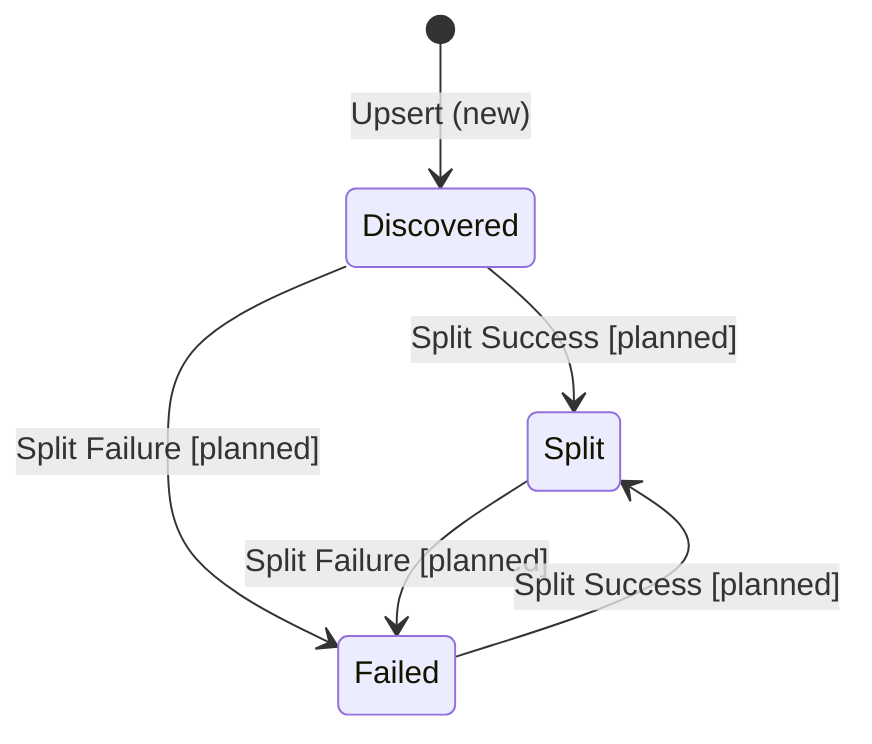
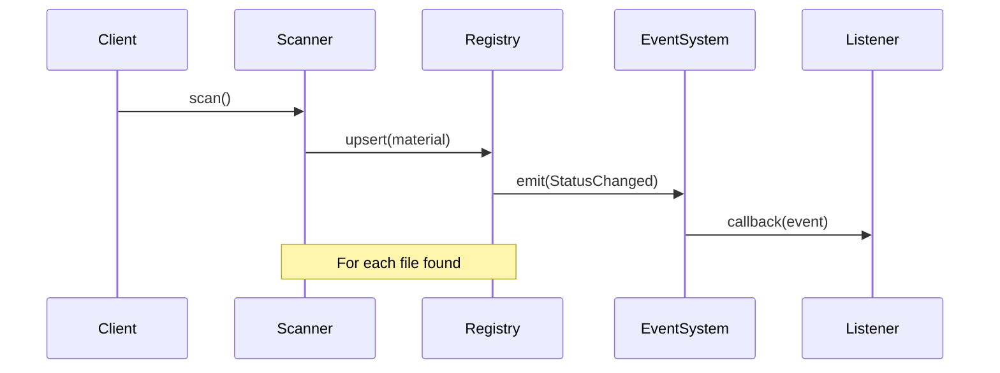

# Material Architecture

This document outlines the high-level architecture of Quilt's Markdown-only material ingestion pipeline. The system is designed to be reactive and event-driven, with the **Material Registry** acting as both the state store and the event emitter.

## Core Types

### Material

```rust
/// A Material represents a Markdown file in Quilt
pub struct Material {
    /// Unique identifier for the material (CUID)
    pub id: String,
    /// Path to the file on the filesystem
    pub file_path: String,
    /// Type of the material file (currently Markdown)
    pub file_type: MaterialFileType,
    /// Timestamp when the material was first ingested
    pub ingested_at: OffsetDateTime,
    /// Current status of the material
    pub status: MaterialStatus,
    /// Error message if material cannot be analyzed
    pub error: Option<String>,
}

/// The possible states of a material
pub enum MaterialStatus {
    /// Material has been discovered but not yet processed
    Discovered,
    /// Material was successfully split into chunks [planned]
    Split,
    /// Material could not be split [planned]
    Failed,
}

/// Events emitted during material processing
pub enum MaterialEvent {
    StatusChanged {
        material: Material,
        old_status: Option<MaterialStatus>,
        error: Option<String>,
    },
}
```

### Usage Examples

```rust
use quilt::{Material, MaterialStatus};

// Create a new material
let material = Material::new("notes/project-overview.md".to_string());
assert_eq!(material.status, MaterialStatus::Discovered);

// Material starts in Discovered state
assert_eq!(material.status, MaterialStatus::Discovered);
assert!(material.error.is_none());

// Material can be split successfully [planned]
let mut split = material;
split.status = MaterialStatus::Split;
assert_eq!(split.status, MaterialStatus::Split);

// Or marked as failed with an error [planned]
let mut failed = material;
failed.status = MaterialStatus::Failed;
failed.error = Some("Cannot split into meaningful chunks".to_string());
```

## Component Architecture

### Material Registry

The Material Registry serves as both a state store and event emitter:

```rust
pub struct MaterialRegistry {
    materials: HashMap<String, Material>,
    events: EventEmitter<MaterialEvent>,
}
```

Key features:

- In-memory storage of materials
- Unified upsert operation for adding/updating materials
- Event emission on status changes
- Duplicate path detection
- Error handling for common cases

### Directory Scanner

The scanner provides configurable directory traversal:

```rust
pub struct DirectoryScanner<'a> {
    base_dir: PathBuf,
    registry: &'a mut MaterialRegistry,
    ignore_hidden: bool,
}

impl<'a> DirectoryScanner<'a> {
    pub fn new(base_dir: impl AsRef<Path>, registry: &'a mut MaterialRegistry) -> ScanResult<Self> {
        // Initialize scanner
    }

    pub fn ignore_hidden(mut self, ignore: bool) -> Self {
        // Configure hidden file handling
    }

    pub fn scan(&mut self) -> ScanResult<ScanResults> {
        // Scan directory and register materials
    }
}
```

### Event System

The event system uses a callback-based approach:

```rust
// Subscribe to events
registry.on(|event| {
    match event {
        MaterialEvent::StatusChanged { material, old_status, error } => {
            // Handle status change
        }
    }
});

// Emit events (internal)
self.events.emit(MaterialEvent::StatusChanged {
    material: material.clone(),
    old_status: Some(old_status),
    error: material.error.clone(),
});
```

## Material Lifecycle

1. **Discovery**

   - Scanner finds file in watched directory
   - Basic file system checks (existence, permissions)
   - Hidden file filtering (if configured)

2. **Registration**

   - Material instance created with CUID
   - Duplicate path checking
   - Initial status set to Discovered
   - Discovery event emitted

3. **Analysis Check** [planned]

   - Content structure verification
   - Chunk/split attempt
   - Status updated to Analyzable/Unanalyzable
   - Status change event emitted

4. **Updates** [planned]
   - File changes detected
   - Analysis check re-run
   - Status updated if needed
   - Events emitted for changes

## Error Handling

### Scanner Errors

```rust
pub enum ScanError {
    PathNotFound(PathBuf),
    IoError(std::io::Error),
}
```

### Registration Failures

- Duplicate path detection
- Permission issues
- IO errors during reading
- Hidden file filtering

### Event Error Handling

Events include:

- Previous status for tracking transitions
- Optional error messages
- Material reference for context

## State Machine



## Event Flow



## Implementation Status

✅ Completed:

- Basic Material struct with CUID-based IDs
- MaterialStatus enum for state tracking
- MaterialRegistry with unified upsert operation
- Event system for status changes
- Error handling for common cases
- Directory scanning with hidden file support
- Configuration options for scanning behavior

🚧 In Progress:

- File watching support
- Content analysis

## Future Enhancements

1. **Async Support**

   ```rust
   impl MaterialRegistry {
       pub async fn upsert(&self, material: Material) -> Option<Material> {
           // Async implementation
       }
   }
   ```

2. **Content Analysis** [planned]

   ```rust
   pub trait ContentAnalyzer {
       fn can_analyze(&self, material: &Material) -> AnalysisResult;
   }
   ```

3. **File Watching**
   ```rust
   impl MaterialRegistry {
       pub async fn watch_directory(&self, path: &str) -> Result<(), Error> {
           // Implement file watching
       }
   }
   ```
