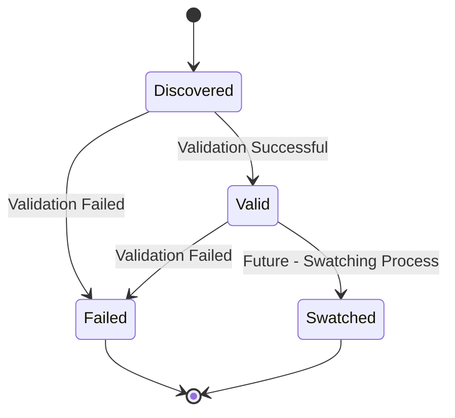
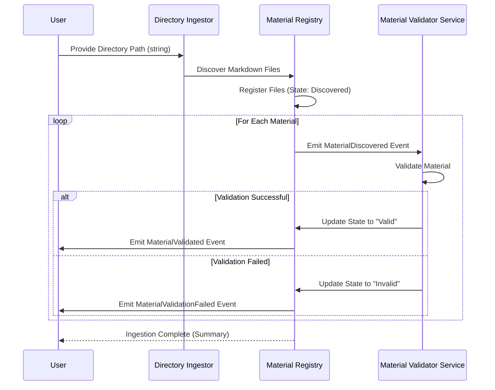

# Quilt Material Ingestion Architecture

This document outlines the high-level architecture of Quilt's Markdown-only material ingestion pipeline. The system is designed to be reactive and event-driven, with the **Material Registry** acting as both the state store and the event emitter. We use Rust traits as an abstraction for processing components.

## Overview

Quilt ingests Markdown files from a user-specified directory. Each file is registered as a **Material** with a lifecycle that tracks its state from discovery through validation. State transitions are emitted as events so that downstream services can react immediately.

## Implementation Phases

### Phase 1: Material Ingestion (Current)

- Directory scanning and file discovery
- Material validation
- Basic registry functionality
- Event system foundation

### Phase 2: Swatching (Future)

- Swatch creation from Materials (see `swatch.md`)
- Extended Material states
- Swatch storage and indexing
- Enhanced event types for Swatching

## Material Lifecycle

Each material goes through the following states:

Current States:

- **Discovered:** The file is found in the directory.
- **Valid:** The file has passed validation.
- **Invalid:** The file failed validation, with an associated error message.

Future States (Phase 2):

- **Swatched:** The material has been successfully processed into Swatches.

### State Machine Diagram



# Event-Driven Flow

Each state transition emits an event. Downstream components subscribe to these events and act accordingly.

## Sequence Diagram for Material Ingestion



## Trait-Based Design (Rust)

In Rust, we use traits to define the interfaces for our processing components. Below are the core type definitions and traits for our system.

```rust
use time::OffsetDateTime;
use cuid2::cuid;

/// Supported file types (currently only Markdown)
#[derive(Debug, Clone, PartialEq, Eq)]
pub enum MaterialFileType {
    Markdown,
}

/// The possible states of a material during ingestion
#[derive(Debug, Clone, PartialEq, Eq)]
pub enum MaterialStatus {
    Discovered,
    Valid,
    Invalid,
}

/// A Material represents a Markdown file in Quilt
#[derive(Debug, Clone)]
pub struct Material {
    pub id: String,          // CUID for unique identification
    pub file_path: String,
    pub file_type: MaterialFileType,
    pub ingested_at: OffsetDateTime,
    pub status: MaterialStatus,
    pub error: Option<String>,
}

/// Events emitted during material processing
#[derive(Debug, Clone)]
pub enum MaterialEvent {
    Discovered(Material),
    Validated(Material),
    ValidationFailed(Material, String), // Contains error message
}

/// Trait for processing a Material
pub trait MaterialProcessor {
    /// Process a material and update its state
    fn process(&self, material: &Material) -> MaterialEvent;
}

/// Example trait implementation for material validation
pub struct MaterialValidatorService;

impl MaterialProcessor for MaterialValidatorService {
    fn process(&self, material: &Material) -> MaterialEvent {
        // In a real implementation, add validation logic here.
        // For now, we'll simply mark the material as valid.
        MaterialEvent::Validated(Material {
            status: MaterialStatus::Valid,
            ..material.clone()
        })
    }
}

/// Trait for ingesting a directory of materials
pub trait DirectoryIngestor {
    /// Ingests all Markdown files from the provided directory path.
    /// Returns a list of MaterialEvents (typically MaterialDiscovered events).
    fn ingest_directory(&self, directory_path: &str) -> Vec<MaterialEvent>;
}

```

## Material Registry as Event Bus

The Material Registry acts as the central state store and event emitter. It listens for events (e.g., material discovery, validation results) and updates its internal state accordingly. This unified approach enables reactive programming, where state changes trigger further processing.

### Summary

- **Reactive, Event-Driven Pipeline:**
  Every state change in a material's lifecycle is emitted as an event for reactive processing.

- **Unified State Store:**
  The Material Registry keeps track of each material and its current state.

- **Trait-Based Abstractions:**
  Rust traits define clear interfaces for processing components like the Material Validator Service.

- **Extensible Design:**
  The architecture is designed to accommodate future enhancements:
  - File watching for real-time updates
  - Additional processing stages (e.g., Swatching in Phase 2)
  - New material types beyond Markdown

This document serves as a foundation for the implementation of Quilt's material ingestion pipeline.
