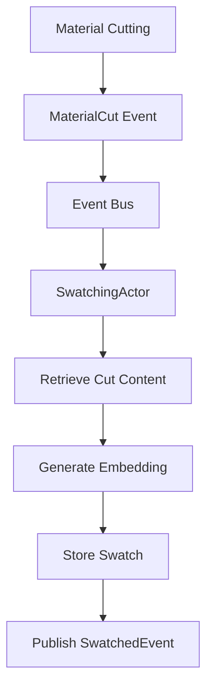
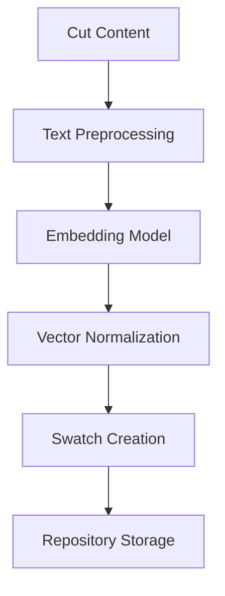
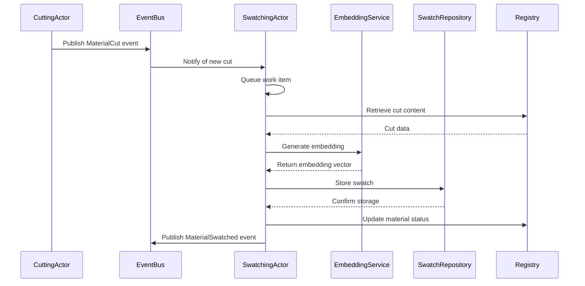

# Material Swatching Architecture

This document outlines how Quilt generates vector embeddings (Swatches) from text fragments (Cuts) using an event-driven, actor-based architecture and HuggingFace embedding models.

## Architecture Overview

Quilt uses an actor-based approach with Actix to handle material swatching operations:

## System Components

### SwatchingActor

- Subscribes to MaterialCut events through a broadcast channel
- Processes cut materials asynchronously
- Delegates embedding generation to the EmbeddingService
- Stores swatches in the SwatchRepository
- Updates material status in the registry
- Maintains isolation through message passing
- Handles failures and publishes error events

### EmbeddingService

- Provides a standardized interface for embedding generation
- Encapsulates model-specific implementation details
- Manages model loading and initialization
- Handles retry logic for transient failures
- Returns normalized vector embeddings

### HfEmbeddingService

- Implements the EmbeddingService interface
- Uses the fastembed library to access HuggingFace models
- Provides configurable model selection
- Validates input text before processing
- Implements error handling and retries for model loading

### SwatchRepository

- Stores and retrieves swatches
- Serializes embedding vectors for storage
- Provides similarity search capabilities
- Manages relationships between swatches, cuts, and materials
- Implements efficient batch operations

### Event System

- Broadcasts material lifecycle events
- Uses Tokio broadcast channels for pub/sub
- Enables loose coupling between system components
- Supports multi-subscriber pattern
- Provides guaranteed delivery to active subscribers

## Embedding Process

Quilt transforms cut content into embeddings through the following process:

### Division of Responsibilities

#### Quilt Handles:

- **Event Processing** - Subscribing to MaterialCut events and coordinating the swatching process
- **Repository Access** - Retrieving cuts and storing swatches
- **Error Management** - Handling failures and reporting issues
- **Context Preservation** - Maintaining relationships between cuts, materials, and swatches

#### EmbeddingService Provides:

- **Model Management** - Loading and initializing the embedding model
- **Vector Generation** - Converting text to fixed-dimension vectors
- **Error Handling** - Managing and reporting issues during the embedding process
- **Model Configuration** - Selecting and configuring appropriate models

## Processing Flow

The process of creating swatches follows this asynchronous sequence:

## Message Types

The SwatchingActor handles several message types:

1. **MaterialCut** - Event notification that a material has been cut
2. **OperationComplete** - Response message indicating operation completion
3. **Ping** - Health check message
4. **Shutdown** - Signal to gracefully shut down

## Error Handling

Errors during swatching are handled through the event system:

1. If embedding generation fails, the error is logged and published as an event
2. If model loading fails, the system attempts to retry with exponential backoff
3. If repository operations fail, the error is logged and published
4. The material status is updated to reflect the error
5. The process continues with the next material

See [Swatching Error Handling](./swatching-errors.md) for details on error types and recovery strategies.

## Embedding Model

Quilt uses the HuggingFace fastembed library with the following default configuration:

- **Default Model**: BGE Small English v1.5
- **Dimensions**: 384
- **Model Type**: Sentence transformer
- **Normalization**: Unit vectors (cosine similarity optimized)

## Swatch Storage

Swatches are stored in SQLite with the following characteristics:

- Embedding vectors stored as binary blobs (native endian F32 values)
- Foreign key relationships to cuts and materials
- Metadata stored as JSON
- Support for batch operations
- Optimized for retrieval by cut or material ID

## Swatching States

Materials progress through the following states during swatching:

1. **Cut** - Initial state after cutting is complete
2. **Processing** - Currently being processed by the SwatchingActor
3. **Swatched** - Successfully processed with swatches created
4. **Error** - Failed to process due to an error

## Implementation Status

The SwatchingActor has been fully implemented with:

- ✅ Event subscription and processing
- ✅ Asynchronous processing with Tokio and Actix
- ✅ Embedding generation via HuggingFace models
- ✅ Swatch creation and storage
- ✅ Repository integration with SQLite
- ✅ Error handling and recovery
- ✅ Status management and event publishing
- ✅ Comprehensive testing suite

### Testing Approach

The testing strategy for the SwatchingActor includes:

1. **Unit Tests**

   - Mock-based tests using Mockall for CutsRepository, MaterialRepository, and EmbeddingService
   - Tests for happy path scenarios with successful embeddings
   - Tests for error conditions and recovery mechanisms
   - Tests verifying correct event flow and status updates

2. **Integration Tests**

   - End-to-end tests with in-memory repositories
   - Tests covering the full material lifecycle
   - Tests for edge cases such as empty content and very long text
   - Tests for concurrent processing scenarios

3. **Embedding Tests**
   - Tests for actual embedding generation using HuggingFace models
   - Tests for consistency of embedding dimensions
   - Tests for semantic similarity between related content
   - Tests for error handling in model loading and processing

All tests are automated and integrated into the continuous integration pipeline.

## Future Enhancements

- **Advanced vector search** - Implementing approximate nearest neighbor algorithms
- **Multiple embedding models** - Supporting different models for different content types
- **Vector quantization** - Reducing storage requirements while maintaining recall
- **Streaming processing** - Processing embeddings in real-time as cuts are created
- **Distributed embedding** - Supporting external embedding services and load balancing
- **Hybrid search** - Combining vector and keyword search for improved results
