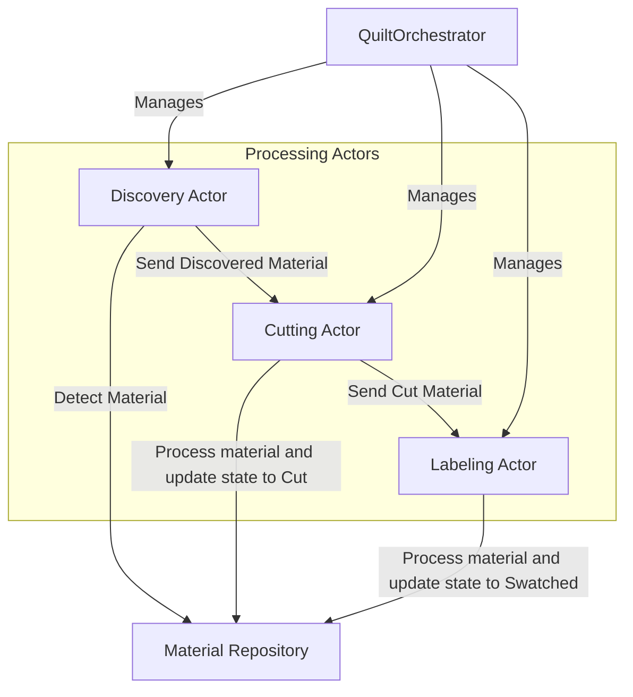
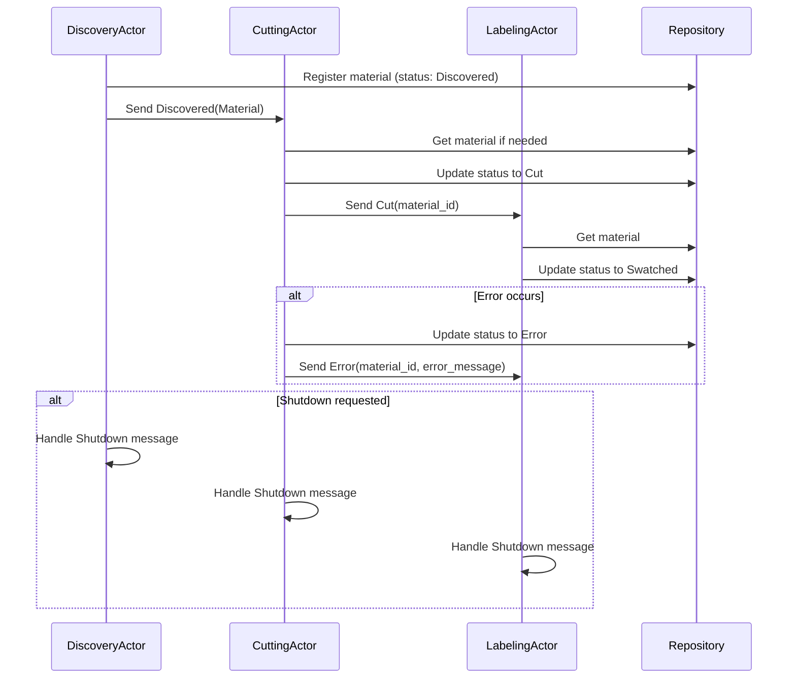
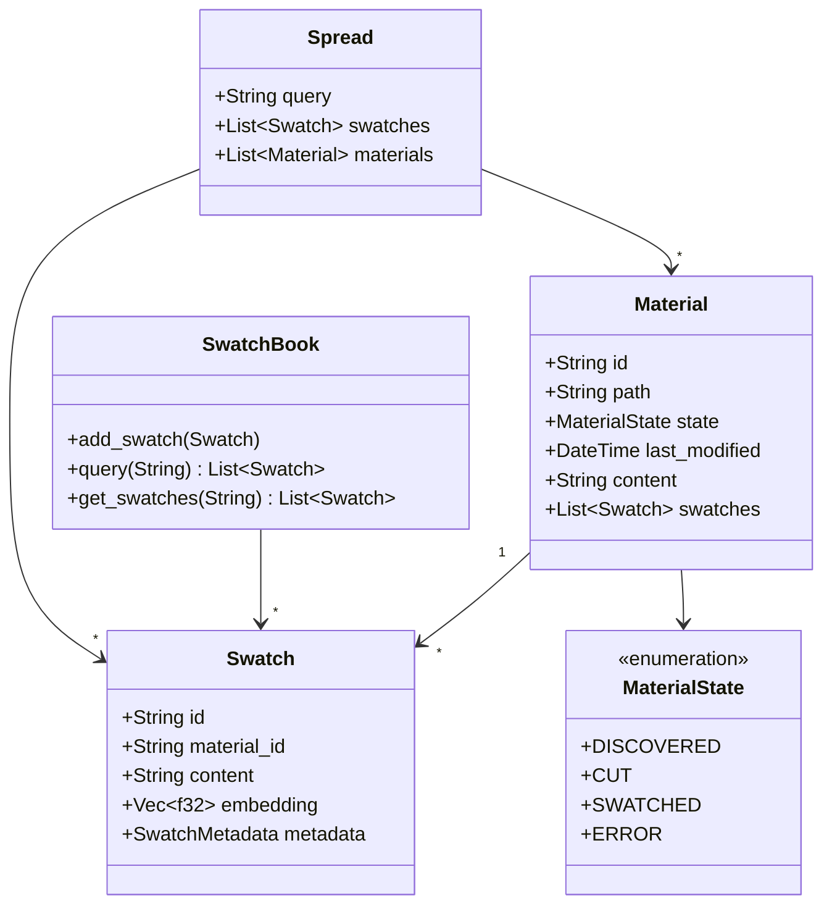

# System Patterns

## Architecture Overview

Quilt uses an **actor model architecture** implemented with Actix. The system processes materials through a pipeline of specialized actors, with a thread-safe repository serving as the single source of truth.

## Key Design Patterns

### Orchestrator Pattern

- **QuiltOrchestrator**: Central component responsible for actor lifecycle management
- **Actor Initialization**: The orchestrator creates and initializes all actors in the system
- **Message Flow Coordination**: Establishes connections between actors
- **Graceful Shutdown**: Manages orderly shutdown of the actor system
- **Error Handling**: Centralizes error handling logic for actor operations
- **Configuration Management**: Handles actor-specific configuration settings

### Actor Model Implementation

- **Actix Framework**: Using the Actix actor system for message-based concurrency
- **Actor Lifecycle Management**: Proper handling of actor startup and shutdown
- **Message Types**: Clearly defined message types with appropriate response types
- **Direct Messaging**: Actors communicate directly via message passing
- **Shared State**: Thread-safe repository provides consistent state management

### Actor Organization

- **Modular Structure**: Actors are organized in dedicated modules (e.g., src/discovery)
- **Common Messaging**: Shared message types in a central actors module
- **Actor-Specific Messages**: Custom messages defined in the actor's namespace
- **Orchestrator**: Top-level component (src/orchestrator.rs) that coordinates the entire system

### Message Flow Patterns

### Material Processing Pipeline

1. **Discovery Stage**: Scans for new/updated materials, registers them in repository, sends discovery messages
2. **Cutting Stage**: Receives discovery messages, cuts materials into swatches, updates state, sends cut messages
3. **Labeling Stage**: Receives cut messages, embeds swatches, updates state, makes swatches available for queries

### Domain Model

## Technical Decisions

### Actor System Organization: Orchestrator Pattern

- **Rationale**: Centralizes actor management for cleaner code organization
- **Benefits**: Improves maintainability, simplifies main.rs, and provides better separation of concerns
- **Implementation**: QuiltOrchestrator manages actor creation, messaging, and shutdown

### Actor Framework: Actix

- **Rationale**: Provides a robust, production-ready actor system for Rust
- **Benefits**: Well-established in the Rust ecosystem, excellent documentation and support
- **Implementation**: Actors are implemented with appropriate message handling and lifecycle management

### Runtime Integration: Actix and Tokio

- **#[actix::main]** macro for initializing the Actix system on top of Tokio
- **Tokio Channels**: Leveraging Tokio's async primitives for additional functionality
- **Message Passing**: Using Actix's type-safe message passing system

### Logging: env_logger

- **Structured Logging**: Using the log crate with env_logger implementation
- **Configuration**: Configurable log levels via environment variables
- **Actor Lifecycle Logging**: Logging important events in actor lifecycle (start, stop, message handling)

### State Management: In-memory with Persistence

- **Initial Implementation**: In-memory repository with thread-safe access for concurrent operations
- **Future Evolution**: Add persistent storage and recovery mechanisms

### Modular Design

- **Independent Components**: Each actor is independently implementable and testable
- **Actor Namespaces**: Organizing actors in dedicated modules for better code organization
- **Plugin Architecture**: Long-term goal to allow custom implementations of each actor
