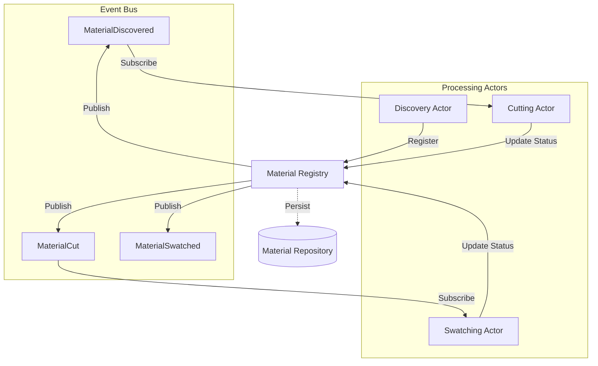
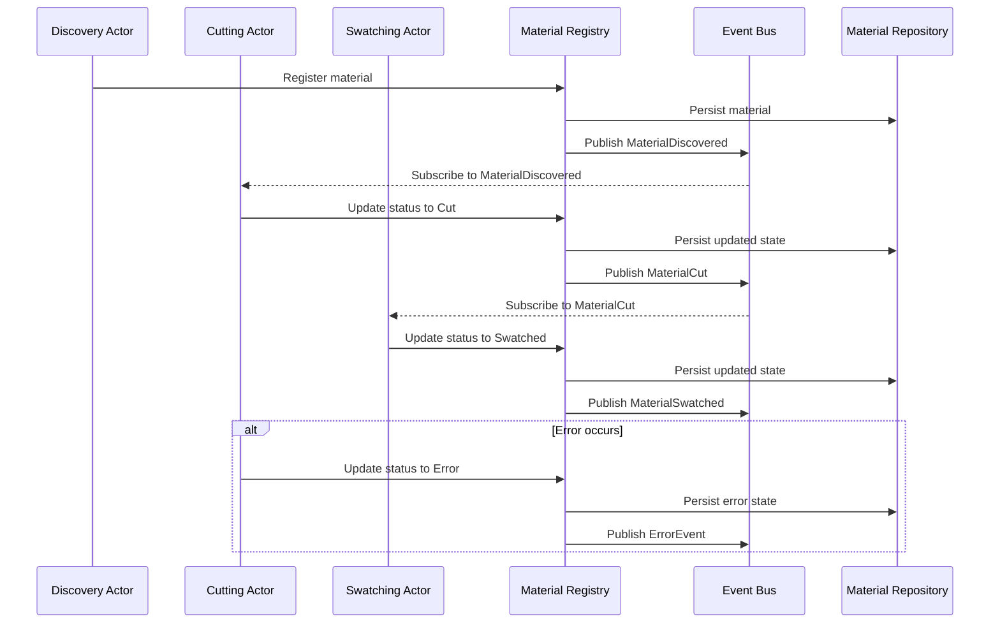
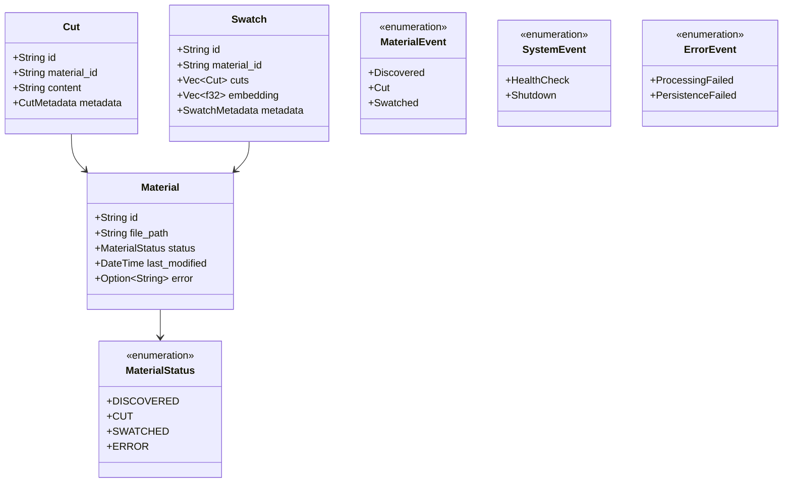

# System Patterns

## Architecture Overview

Quilt uses an **event-driven actor model architecture** implemented with Actix for actor lifecycle management and Tokio for concurrency primitives. The system processes materials through a pipeline of independent actors that communicate via an Event Bus, with a Material Registry serving as the central coordinator for state and event publishing.

## Key Design Patterns

### Event-Driven Architecture

- **Event Bus**: System-wide bus implemented with Tokio broadcast channels
- **Event Publishing**: Registry publishes events on state changes
- **Event Subscription**: Actors subscribe to events they need to process
- **Decoupling**: No direct actor-to-actor coupling, enabling independent scaling

### State Management and Registry Pattern

- **Material Registry**: Central coordinator for material state
- **State Changes**: Atomic operations with event publishing
- **Separation of Concerns**: Registry manages state, Repository handles persistence
- **Single Source of Truth**: Registry provides consistent view of system state

### Actor Model Implementation

- **Actix for Lifecycle**: Using Actix for actor management
- **Tokio for Concurrency**: Using Tokio primitives for synchronization
- **Event Subscription**: Actors subscribe to relevant event channels
- **Backpressure Handling**: Controlling event consumption rate

### Material Processing Flow

### Domain Model

## Technical Decisions

### Event Bus Implementation

- **Tokio Broadcast Channels**: Using `tokio::sync::broadcast` for event distribution with a default capacity of 128
- **Multiple Consumers**: Supporting multiple subscribers with independent receivers
- **Event Types**: Implemented MaterialDiscovered and System events (Shutdown, HealthCheck)
- **Error Handling**: Comprehensive error handling with EventBusError and detailed logging
- **Subscription Management**: Simple subscribe() method returning a Receiver
- **Event Publishing**: Publish method with receiver count logging and error propagation
- **EventSubscriber Trait**: Helper trait for processing events from a receiver
- **Comprehensive Tests**: Test coverage for publishing, multiple subscribers, and event processing

### Actor Implementation

- **Actix Actors**: Implementing actors using the Actix framework
- **Event Processing**: Subscribing to events during actor initialization
- **Async Processing**: Using `ResponseFuture` for long-running operations
- **Supervision**: Implementing proper error handling and recovery strategies

### State Management

- **Thread-Safe Registry**: Using Tokio's RwLock for thread-safe state access
- **Atomic Operations**: Ensuring state changes and event publishing are atomic
- **Persistence Layer**: Separate repository for persistent storage

### Concurrency Safety

- **Synchronization Primitives**: Using appropriate primitives for shared state
- **Message Passing**: Relying on message passing for inter-actor communication
- **Ownership Model**: Leveraging Rust's ownership system for safety

## Implementation Approach

The system is being implemented incrementally, with each milestone providing a tangible, demonstrable change:

1. First establishing the Event Bus and Material Registry
2. Updating Discovery Actor to publish events
3. Creating processing actors that subscribe to events and implement internal backpressure queues
4. Implementing the full pipeline with proper event flow
5. Adding query capabilities and persistence

## Additional Details

- **Cutting:** The `CuttingActor` subscribes to `MaterialDiscovered` events from the bus, processes materials into cuts (using `text-splitter`), and publishes `MaterialCut` events back onto the bus after updating the `MaterialRegistry`. It now uses an internal SPSC `mpsc` channel to manage backpressure between its event listener task and its processing task.
- **Swatching (Future):** A `SwatchingActor` will subscribe to `MaterialCut` events, perform embedding (potentially concurrently), update the registry, and publish `MaterialSwatched` events. It will also use an internal `mpsc` queue for backpressure.
- **Reconciliation:** A dedicated `ReconciliationActor` periodically scans the `MaterialRegistry` for materials stuck in intermediate states. It attempts retries by re-publishing the preceding event onto the `EventBus` and eventually marks items as `Error` if retries fail.

### Key Components

- **Actors:** Actix actors (`DiscoveryActor`, `CuttingActor`, `SwatchingActor`, `ReconciliationActor`) encapsulate stage-specific logic.
- **Shared Event Bus:** A single `tokio::sync::broadcast` channel for all inter-actor event communication.
- **Internal Queues:** Bounded `tokio::sync::mpsc` channels within `CuttingActor` and `SwatchingActor` to buffer work and provide backpressure between internal listener/processor tasks.
- **Material Registry:** Central coordinator for state (`status`, `last_status_update`, `retry_count`), persistence orchestration, and primary event publishing.
- **Material Repository:** Trait defining persistence operations (implemented initially with an in-memory store).

### Backpressure & Resilience

- **Intra-Actor Backpressure:** The primary mechanism. The listener task blocks if the internal `mpsc` queue is full.
- **Inter-Actor Decoupling:** The broadcast bus decouples stages, but listeners can lag (`RecvError::Lagged`) if their internal queues remain full.
- **Resilience:** The `ReconciliationActor` mitigates issues caused by lag, crashes, or processing errors by retrying stuck items.

### State Management

- The `MaterialRegistry` is the source of truth for material status, timestamps, and retry counts.
- The `MaterialRepository` handles the actual persistence of this state.
- Events are published by the Registry _after_ state is successfully persisted.

### Implementation

- Built using Actix for actor management and Tokio for async runtime, channels (`broadcast`, `mpsc`), and synchronization.
- Detailed implementation patterns and considerations are documented in `docs/src/features/actor-model-architecture.md`.
