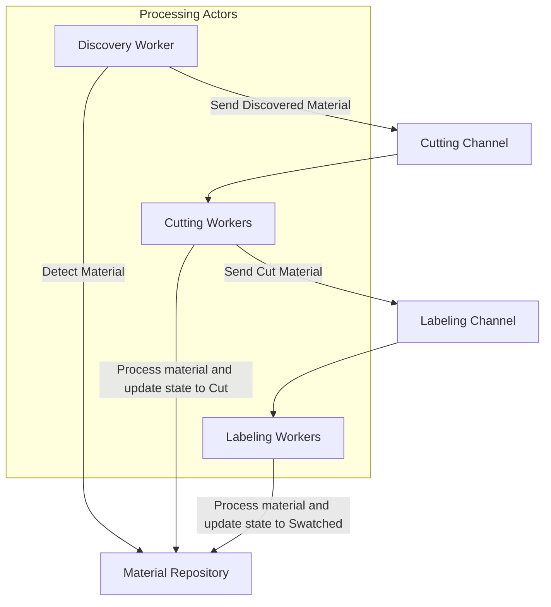
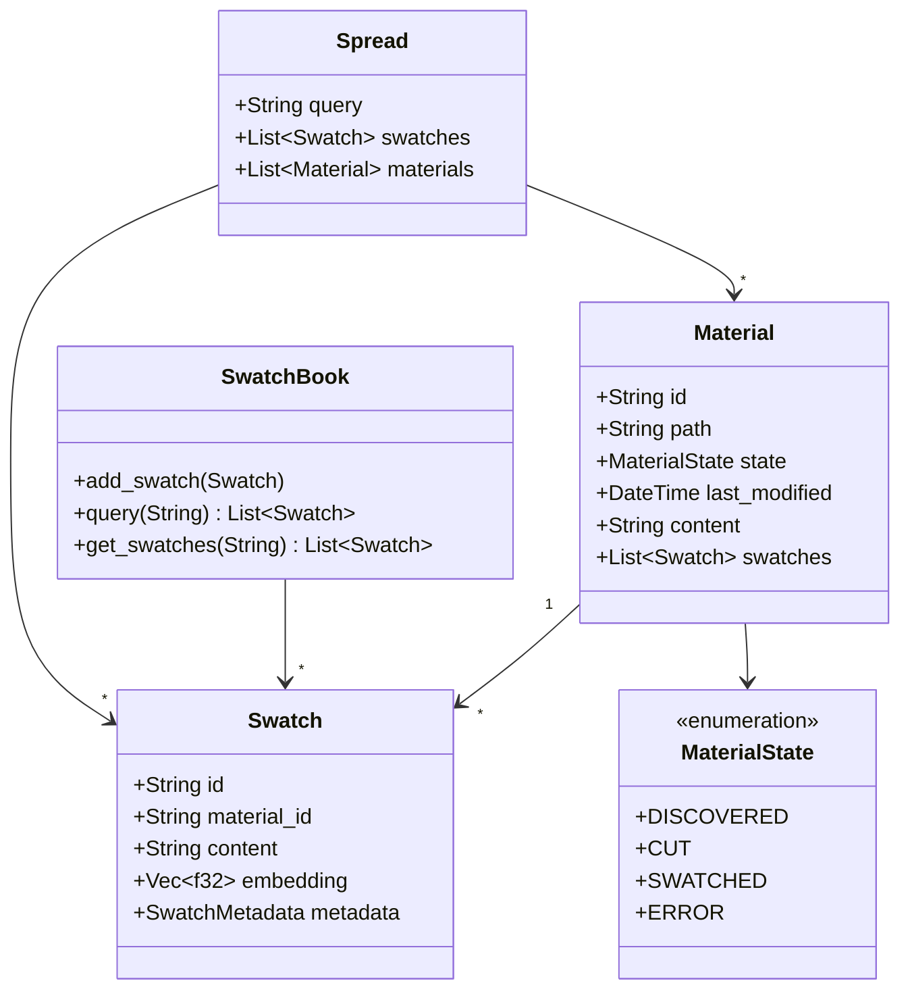
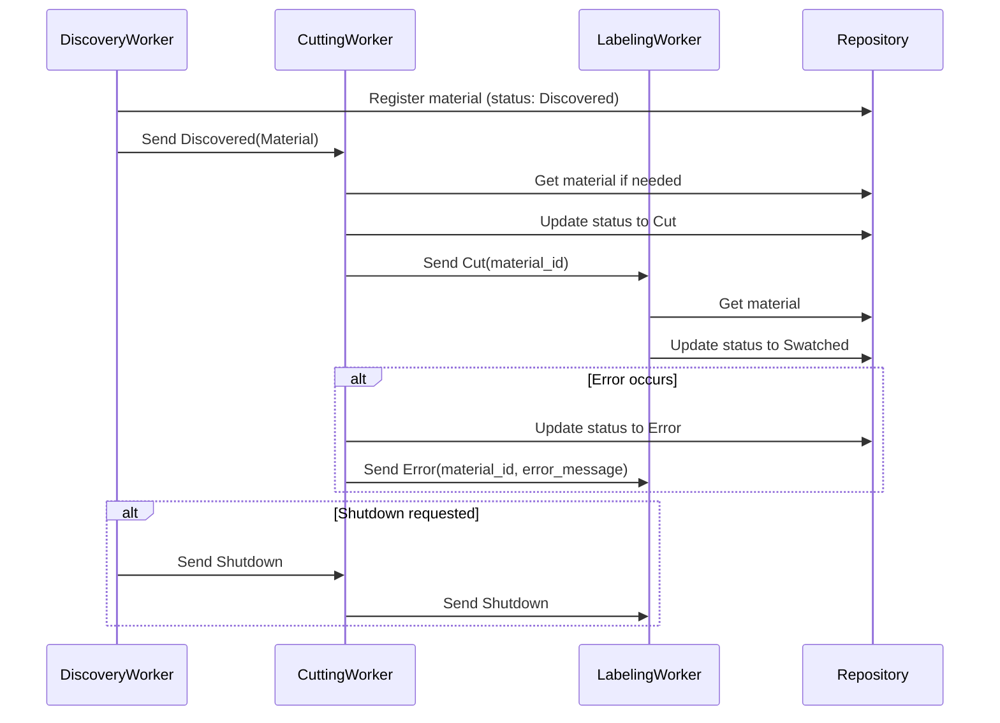

# System Patterns

## Architecture Overview

Quilt uses a **simplified actor model architecture** with a dedicated repository. The system processes materials through a linear pipeline of specialized worker actors, with a thread-safe repository serving as the single source of truth.

## Key Design Patterns

### Actor Model Implementation

- **Worker Actors**: Independent Tokio tasks that process messages from their input channels
- **Direct Messaging**: Workers communicate directly via channels, without a central dispatcher
- **Shared State**: Thread-safe repository provides consistent state management

### Message Channel System

- **Typed Messages**: `MaterialMessage` enum with five variants (Discovered, Cut, Swatched, Error, Shutdown)
- **Bounded Channels**: Fixed capacity (100 messages) to provide natural backpressure
- **Extension Traits**: Helper methods for ergonomic message handling and error management
- **Message Size Optimization**: Using only material IDs for Cut and Swatched messages to minimize payload size
- **Error Handling**: Structured error types for different failure modes (SendError, ReceiveTimeout, ChannelClosed)

### Material Processing Pipeline

1. **Discovery Stage**: Scans for new/updated materials, registers them in repository, sends discovery messages
2. **Cutting Stage**: Receives discovery messages, cuts materials into swatches, updates state, sends cut messages
3. **Labeling Stage**: Receives cut messages, embeds swatches, updates state, makes swatches available for queries

### Concurrency and Coordination

- **Bounded Channels**: Provide natural backpressure if downstream stages can't keep up
- **Idempotent Processing**: Repository ensures each material is processed exactly once per stage
- **Thread Safety**: Repository uses `Arc<RwLock<HashMap<...>>>` for concurrent access

### Domain Model

## Message Flow Patterns

## Technical Decisions

### Async Runtime: Tokio

- **Rationale**: Provides robust async primitives, channels, and task management
- **Benefits**: Well-established in the Rust ecosystem, excellent documentation and support

### Messaging: Tokio MPSC Channels

- **Channel Capacity**: Fixed at 100 messages to balance throughput and memory usage
- **Backpressure**: Natural backpressure when channels fill up
- **Error Handling**: Structured error types with extension traits for ergonomic handling

### State Management: In-memory with Persistence

- **Initial Implementation**: In-memory repository with `Arc<RwLock<HashMap>>` for concurrent access
- **Future Evolution**: Add persistent storage and recovery mechanisms

### Modular Design

- **Independent Components**: Each stage is independently implementable and testable
- **Plugin Architecture**: Long-term goal to allow custom implementations of each stage
