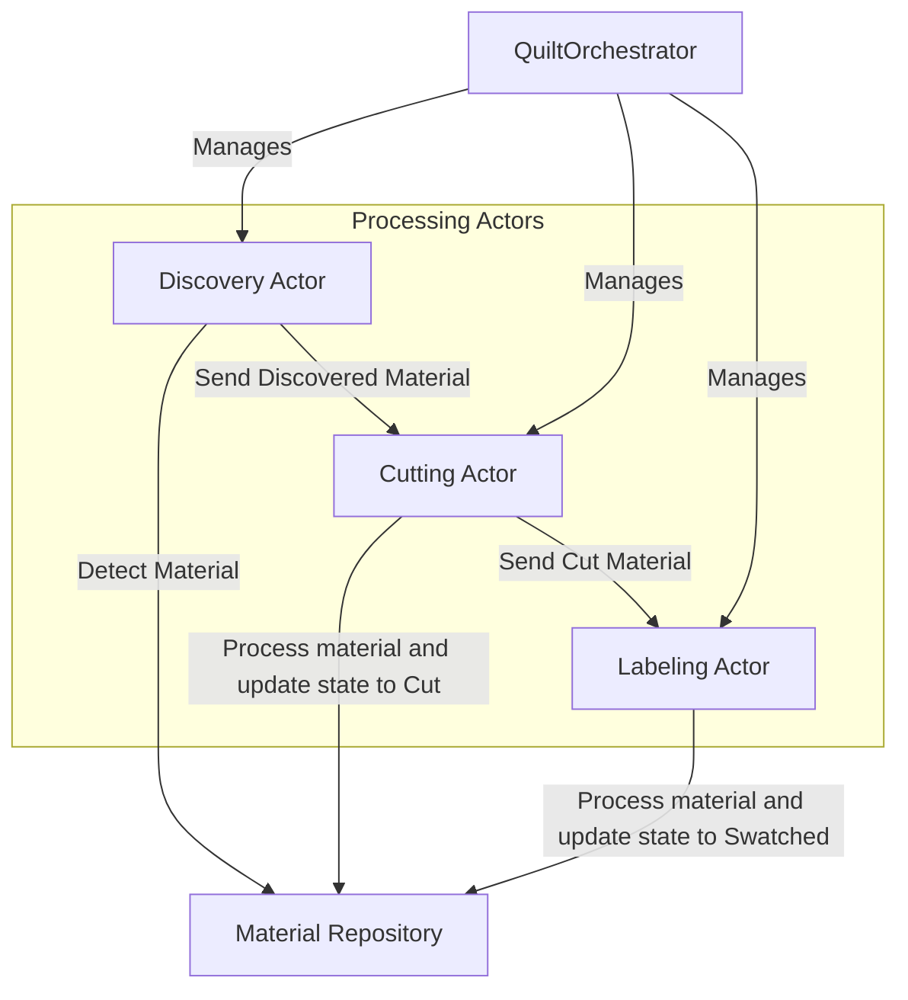
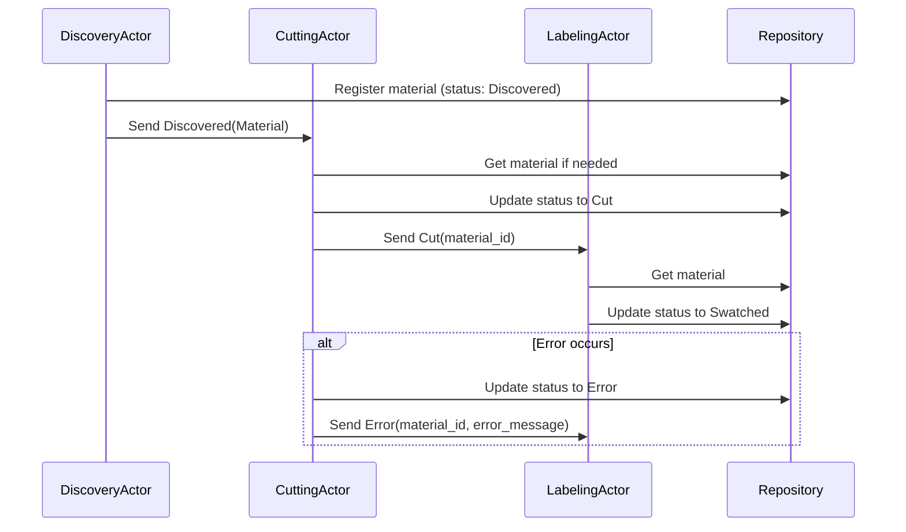
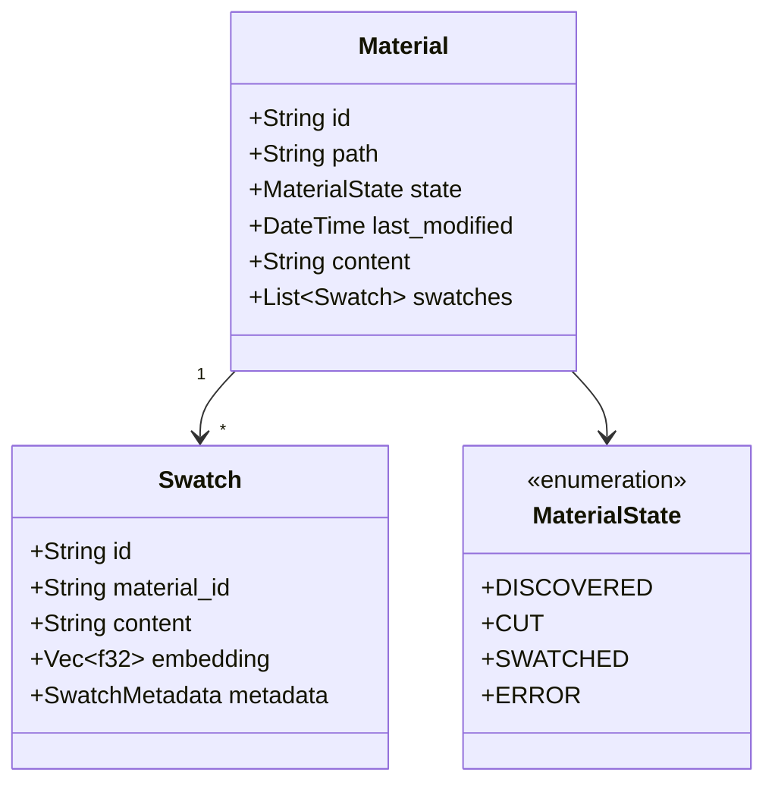

# System Patterns

## Architecture Overview

Quilt uses an **actor model architecture** implemented with Actix. The system processes materials through a pipeline of specialized actors, with a thread-safe repository serving as the single source of truth.

## Key Design Patterns

### Orchestrator Pattern

- **QuiltOrchestrator**: Central component responsible for actor lifecycle management
- Handles actor initialization, message flow coordination, and graceful shutdown
- Centralizes error handling and configuration management

### Actor Model Implementation

- **Actix Framework**: Using Actix for message-based concurrency
- **Actor Lifecycle**: Proper handling of actor startup and shutdown
- **Direct Messaging**: Actors communicate via typed message passing
- **Shared State**: Thread-safe repository provides consistent state

### Message Flow Patterns

### Material Processing Pipeline

1. **Discovery Stage**: Scans for new/updated materials, registers them, sends discovery messages
2. **Cutting Stage**: Receives discovery messages, cuts materials into swatches, sends cut messages
3. **Labeling Stage**: Receives cut messages, embeds swatches, makes them available for queries

### Domain Model

## Technical Decisions

### Actor System: Orchestrator Pattern

- Centralizes actor management for cleaner code organization
- QuiltOrchestrator manages actor creation, messaging, and shutdown

### Actor Framework: Actix

- Provides a robust, production-ready actor system for Rust
- Actors implement appropriate message handling and lifecycle management

### Runtime Integration: Actix and Tokio

- **#[actix::main]** macro initializes the Actix system on top of Tokio
- Leverages Tokio's async primitives for additional functionality

### State Management

- In-memory repository with thread-safe access for concurrent operations
- Plans to add persistent storage in future milestones
